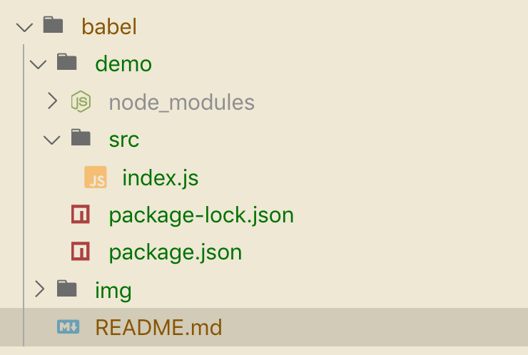
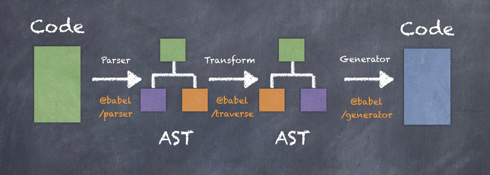
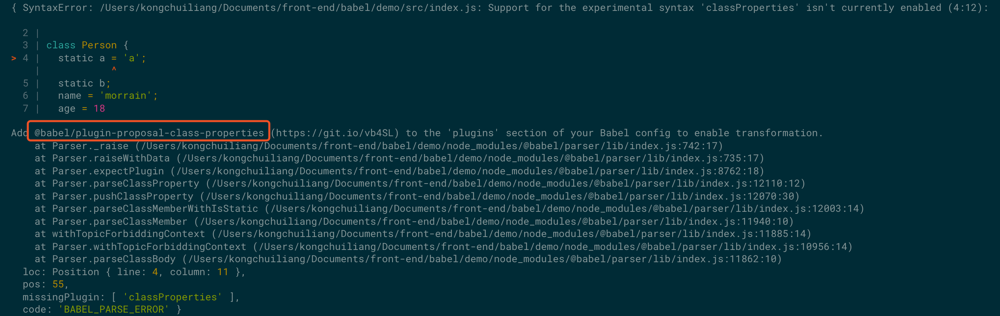
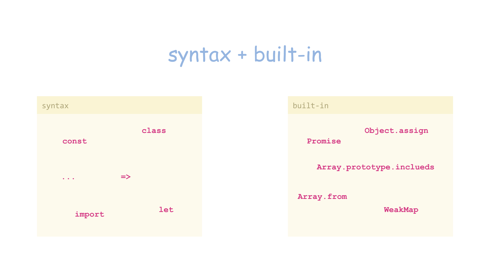
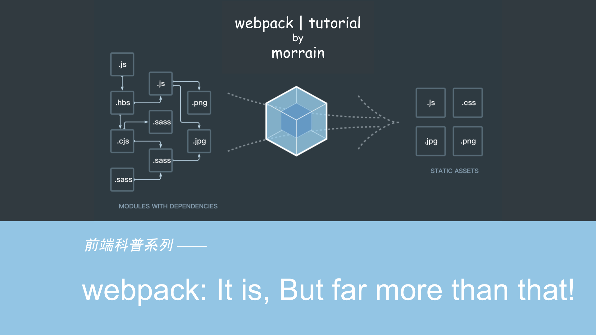

# Babel：把 ES6 送上天的通天塔


- [Web：一路前行一路忘川](../history/README.md)
- [Node.js：换个角度看世界](../node/README.md)
- [CommonJS：不是前端却革命了前端](../module/README.md)
- [Babel：把 ES6 送上天的通天塔](../babel/README.md)
- [webpack：它是如此，但远不止于此](../webpack/README.md)

## 前言

在上一节 《CommonJS：不是前端却革命了前端》中，我们聊到了 ES6 Module，它是 ES6 中对模块的规范，ES6 是 ECMAScript 6.0 的简称，**泛指** JavaScript 语言的下一代标准，它的第一个版本 ES2015 已经在 2015 年 6 月正式发布，本文中提到的 ES6 包括 ES2015、ES2016、ES2017等等。在第一节的《Web：一路前行一路忘川》中也提到过，ES2015 从制定到发布历经了十几年，引入了很多的新特性以及新的机制，浏览器对 ES6 的支持进度远远赶不上前端开发小哥哥们使用 ES6 的热情，于是矛盾就日益显著……

## Babel 是什么

先来看下它在[官网](https://babeljs.io/)上的定义：

**Babel is a JavaScript compiler**

没错就一句话，Babel 是 JavaScript 的编译器。至于什么是编译器，可以参考 [the-super-tiny-compiler](https://github.com/thejameskyle/the-super-tiny-compiler) 这个项目，可以找到很好的答案。

> 本文是以 Babel 7.9.0 版本进行演示和讲解的，另外建议学习者阅读英文官网，中文官网会比原版网站慢一个版本，并且很多依然是英文的。

Babel 就是一套解决方案，用来把 ES6 的代码转化为浏览器或者其它环境支持的代码。**注意我的用词哈，我说的不是转化为 ES5 ，因为不同类型以及不同版本的浏览器对 ES6 新特性的支持程度都不一样，对于浏览器已经支持的部分，Babel 可以不转化，所以 Babel 会依赖浏览器的版本，后面会讲到。 这里可以先参考 [browerslist](https://twitter.com/browserslist) 项目。**

### Babel 的历史

在学习任何一门知识前，我都习惯先了解它的历史，这样才能深刻理解它存在意义。

Babel 的作者是 FaceBook 的工程师 Sebastian McKenzie。他在 2014 年发布了一款 JavaScript 的编译器 `6to5`。从名字就能看出来，它主要的作用就是将 ES6 转化为 ES5。

> 这里的 ES6 指 ES2015，因为当时还没有正式发布， ES2015 的名字还未被正式确定

于是很多人评价，`6to5` 只是 ES6 得到支持前的一个过渡方案，它的作者非常不同意这个观点，认为 `6to5` 不光会按照标准逐步完善，依然具备非常大的潜力反过来影响并推进标准的制定。正因为如此 `6to5` 的团队觉得 '6to5' 这个名字并没有准确的传达这个项目的目标。加上 ES6 正式发布后，被命名为 ES2015，对于 `6to5` 来说更偏离了它的初衷。于是 2015 年 2 月 15 号，`6to5` 正式更名为 Babel。


Babel 是巴比伦文化里的通天塔，用来给 `6to5` 这个项目命名真得太贴切了！羡慕这些牛逼的人，不光代码写得好，还这么有文化，不像我们，起个变量名都得憋上半天，吃了没有文化的亏。这也是为什么我把这篇文章起名为 《Babel：把 ES6 送上天的通天塔》的原因。

## Babel 怎么用

了解了 Babel 是什么后，很明显我们就要开始考虑怎么使用 Babel 来转化 ES6 的代码了，除了 Babel 本身提供的 cli 等工具外，它还支持和其它打包工具配合使用，譬如 webpack、rollup 等等，可以参考[官网对不同平台提供的配置说明](https://babeljs.io/setup.html)。

> 本文为了感受 Babel 最原始的用法，不结合其它任何工具，直接使用 Babel 的 cli 来演示。

### 构建 Babel 演示的工程

使用如下命令构建一个 npm 包，并新建 src 目录 和 一个 index.js 文件。

```
npm init -y
```


package.json 内容如下:

``` json
{
  "name": "demo",
  "version": "1.0.0",
  "description": "",
  "main": "index.js",
  "scripts": {
    "test": "echo \"Error: no test specified\" && exit 1"
  },
  "keywords": [],
  "author": "",
  "license": "ISC"
}
```

### 安装依赖包

```
npm install --save-dev @babel/core @babel/cli @babel/preset-env
```

> 后面会介绍这些包的作用，先看用法

增加 babel 命令来编译 src 目录下的文件到 dist 目录:

```json
{
  "name": "demo",
  "version": "1.0.0",
  "description": "",
  "main": "src/index.js",
  "scripts": {
    "babel": "babel src --out-dir dist",
    "test": "echo \"Error: no test specified\" && exit 1"
  },
  "keywords": [],
  "author": "",
  "license": "ISC",
  "devDependencies": {
    "@babel/cli": "^7.8.4",
    "@babel/core": "^7.9.0",
    "@babel/preset-env": "^7.9.0"
  }
}

```

### 增加 Babel 配置文件

在工程的根目录添加 `babel.config.js` 文件，增加 Babel 编译的配置，没有配置是不进行编译的。

```js
const presets = [
  [
    '@babel/env',
    {
      debug: true
    }
  ]
]
const plugins = []

module.exports = { presets, plugins }

```
> 上例中 debug 配置是为了打印出 Babel 工作时的日志，可以方便的看来，Babel 转化了哪些语法。

1. presets 主要是配置用来编译的预置，plugins 主要是配置完成编译的插件，具体的含义后面会讲
2. 推荐用 Javascript 文件来写配置文件，而不是 JSON 文件，这样可以根据环境来动态配置需要使用的 presets 和 plugins

```js
const presets = [
  [
    '@babel/env',
    {
      debug: true
    }
  ]
]
const plugins = []

if (process.env["ENV"] === "prod") {
  plugins.push(...)
}

module.exports = { presets, plugins }
```

### 编译的结果

配置好后，我们运行 `npm run babel` 命令，可以看到 dist 文件夹下生成了 index.js 文件，内容如下所示

```js
// src/index.js
const add = (a, b) => a + b

// dist/index.js
"use strict";

var add = function add(a, b) {
  return a + b;
};

```

可以看到，ES6 的 `const` 被转化为 `var` ，箭头函数被转化为普通函数。同时打印出来如下日志：

```
> babel src --out-dir dist

@babel/preset-env: `DEBUG` option

Using targets:
{}

Using modules transform: auto

Using plugins:
  proposal-nullish-coalescing-operator {}
  proposal-optional-chaining {}
  proposal-json-strings {}
  proposal-optional-catch-binding {}
  transform-parameters {}
  proposal-async-generator-functions {}
  proposal-object-rest-spread {}
  transform-dotall-regex {}
  proposal-unicode-property-regex {}
  transform-named-capturing-groups-regex {}
  transform-async-to-generator {}
  transform-exponentiation-operator {}
  transform-template-literals {}
  transform-literals {}
  transform-function-name {}
  transform-arrow-functions {}
  transform-block-scoped-functions {}
  transform-classes {}
  transform-object-super {}
  transform-shorthand-properties {}
  transform-duplicate-keys {}
  transform-computed-properties {}
  transform-for-of {}
  transform-sticky-regex {}
  transform-unicode-regex {}
  transform-spread {}
  transform-destructuring {}
  transform-block-scoping {}
  transform-typeof-symbol {}
  transform-new-target {}
  transform-regenerator {}
  transform-member-expression-literals {}
  transform-property-literals {}
  transform-reserved-words {}
  transform-modules-commonjs {}
  proposal-dynamic-import {}

Using polyfills: No polyfills were added, since the `useBuiltIns` option was not set.
Successfully compiled 1 file with Babel.
```


## Babel 工作原理

在了解了如何使用后，我们一起来探寻一下编译背后的事情，同时会熟悉 Babel 的组成和进阶用法。

### Babel 工作流程

前面提到 Babel 其实就是一个纯粹的 JavaScript 的编译器，任何一个编译器工作流程大致都可以分为如下三步：

- Parser      解析源文件
- Transfrom   转换
- Generator   生成新文件

Babel 也不例外，如下图所示:



因为 Babel 使用是 [`acorn`](https://github.com/acornjs/acorn) 这个引擎来做解析，这个库会先将源码转化为[抽象语法树 (AST)](https://en.wikipedia.org/wiki/Abstract_syntax_tree)，再对 AST 作转换，最后将转化后的 AST 输出，便得到了被 Babel 编译后的文件。

那 Babel 是如何知道该怎么转化的呢？答案是通过插件，Babel 为每一个新的语法提供了一个插件，在 Babel 的配置中配置了哪些插件，就会把插件对应的语法给转化掉。插件被命名为 `@babel/plugin-xxx` 的格式。

### Babel 组成


#### @babel/preset-env

上面提到过 @babel/preset-* 其实是转换插件的集合，最常用的就是 @babel/preset-env，它包含了 大部分 ES6 的语法，具体包括哪些插件，可以在 Babel 的日志中看到。如果源码中使用了不在 @babel/preset-env 中的语法，会报错，手动在 plugins 中增加即可。

例如 ES6 明确规定，Class 内部只有静态方法，没有静态属性。但现在有一个提案提供了类的静态属性，写法是在实例属性的前面，加上 static 关键字。

```js
// src/index.js
const add = (a, b) => a + b

class Person {
  static a = 'a';
  static b;
  name = 'morrain';
  age = 18
}
```

编译时就会报如下错误：



根据报错的提示，添加 @babel/plugin-proposal-class-properties 即可。

```
npm install --save-dev @babel/plugin-proposal-class-properties
```

```js
// babel.config.js
const presets = [
  [
    '@babel/env',
    {
      debug: true
    }
  ]
]
const plugins = ['@babel/plugin-proposal-class-properties']

module.exports = { presets, plugins }

```

@babel/preset-env 中还有一个非常重要的参数 **targets**，最早的时候我们就提过，Babel 转译是按需的，对于环境支持的语法可以不做转换的。就是通过配置 **targets** 属性，让 Babel 知道目标环境，从而只转译环境不支持的语法。**如果没有配置会默认转译所有 ES6 的语法**

```js
// src/index.js
const add = (a, b) => a + b

// dist/index.js  没有配置targets
"use strict";

var add = function add(a, b) {
  return a + b;
};
```

按如下配置 **targets**

```js
// babel.config.js
const presets = [
  [
    '@babel/env',
    {
      debug: true,
      targets: {
        chrome: '58'
      }
    }
  ]
]
const plugins = ['@babel/plugin-proposal-class-properties']

module.exports = { presets, plugins }
```

编译后的结果如下：

```js
// src/index.js
const add = (a, b) => a + b

// dist/index.js  配置targets  chrome 58
"use strict";

const add = (a, b) => a + b;
```

**可以看到 `const` 和箭头函数都没有被转译，因为这个版本的 chrome 已经支持了这些特性。可以根据需求灵活的配置目标环境**

> 为后方便后续的讲解，把 **targets** 的配置去掉，让 Babel 默认转译所有语法。

#### @babel/polyfill

polyfill 直译是垫片的意思，又是 Babel 里一个非常重要的概念。先看下面几行代码:

```js
// src/index.js
const add = (a, b) => a + b

const arr = [1, 2]
const hasThreee = arr.includes(3)
new Promise()
```

按之前的方法，执行 `npm run babel` 后，我们惊奇的发现，Array.prototype.includes 和 Promise 竟然没有被转译！

```js
// dist/index.js
"use strict";

var add = function add(a, b) {
  return a + b;
};

var arr = [1, 2];
var hasThreee = arr.includes(3);
new Promise();
```

原来 Babel 把 ES6 的标准分为 syntax 和 built-in 两种类型。syntax 就是语法，像 `const`、`=>` 这些默认被 Babel 转译的就是 syntax 的类型。而对于那些可以通过改写覆盖的语法就认为是 built-in，像 `includes` 和 `Promise` 这些都属于 built-in。而 Babel 默认只转译 syntax 类型的，对于 built-in 类型的就需要通过 @babel/polyfill 来完成转译。 @babel/polyfill 实现的原理也非常简单，就是覆盖那些 ES6 新增的 built-in。示意如下：

```js
Object.defineProperty(Array.prototype, 'includes',function(){
  ...
})
```



> **由于 Babel 在 7.4.0 版本中宣布废弃 @babel/polyfill ，而是通过 core-js 替代，所以本文直接使用 core-js 来讲解 polyfill 的用法**

- 安装 core-js

  ```
  npm install --save core-js
  ```

  **注意 `core-js` 要使用 --save 方式安装，因为它是需要被注入到源码中的，在执行代码前提供执行环境，用来实现 built-in 的注入**

- 配置 useBuiltIns

    在 @babel/preset-env 中通过 useBuiltIns 参数来控制 built-in 的注入。它可以设置为 'entry'、'usage' 和 `false` 。默认值为 `false`，不注入垫片。

    **设置为 'entry' 时**，只需要在整个项目的入口处，导入 `core-js` 即可。

    ```js
    // src/index.js
    import 'core-js'

    const add = (a, b) => a + b

    const arr = [1, 2]
    const hasThreee = arr.includes(3)
    new Promise()

    // dist/index.js
    "use strict";

    require("core-js/modules/es7.array.includes");
    require("core-js/modules/es6.promise");
    //
    // ……  这里还有很多
    //
    require("regenerator-runtime/runtime");
    var add = function add(a, b) {
      return a + b;
    };
    var arr = [1, 2];
    var hasThreee = arr.includes(3);
    new Promise();
    ```

    编译后，Babel 会把目标环境不支持的所有 built-in 都注入进来，不管是不是用到，这有一个问题，对于只用到比较少的项目来说完全没有必要，白白增加代码，浪费包体大小。

    **设置为 'usage' 时**，就不用在项目的入口处，导入 `core-js`了，Babel 会在编译源码的过程中根据 built-in 的使用情况来选择注入相应的实现。

    ```js
    // src/index.js
    const add = (a, b) => a + b

    const arr = [1, 2]
    const hasThreee = arr.includes(3)
    new Promise()

    // dist/index.js
    "use strict";

    require("core-js/modules/es6.promise");

    require("core-js/modules/es6.object.to-string");

    require("core-js/modules/es7.array.includes");

    var add = function add(a, b) {
      return a + b;
    };

    var arr = [1, 2];
    var hasThreee = arr.includes(3);
    new Promise();
    ```

- 配置 corejs 的版本

    当 useBuiltIns 设置为 'usage' 或者 'entry' 时，还需要设置 @babel/preset-env 的 corejs 参数，用来指定注入 built-in 的实现时，使用 `corejs` 的版本。否则 Babel 日志输出会有一个警告。

最终的 Babel 配置如下：

```js
// babel.config.js
const presets = [
  [
    '@babel/env',
    {
      debug: true,
      useBuiltIns: 'usage',
      corejs: 3,
      targets: {}
    }
  ]
]
const plugins = ['@babel/plugin-proposal-class-properties']

module.exports = { presets, plugins }
```

#### @babel/plugin-transform-runtime

在介绍 @babel/plugin-transform-runtime 的用途之前，先前一个例子：

```js
// src/index.js
const add = (a, b) => a + b

const arr = [1, 2]
const hasThreee = arr.includes(3)
new Promise(resolve=>resolve(10))

class Person {
  static a = 1;
  static b;
  name = 'morrain';
  age = 18
}

// dist/index.js
"use strict";

require("core-js/modules/es.array.includes");

require("core-js/modules/es.object.define-property");

require("core-js/modules/es.object.to-string");

require("core-js/modules/es.promise");

function _classCallCheck(instance, Constructor) { if (!(instance instanceof Constructor)) { throw new TypeError("Cannot call a class as a function"); } }

function _defineProperty(obj, key, value) { if (key in obj) { Object.defineProperty(obj, key, { value: value, enumerable: true, configurable: true, writable: true }); } else { obj[key] = value; } return obj; }

var add = function add(a, b) {
  return a + b;
};

var arr = [1, 2];
var hasThreee = arr.includes(3);
new Promise(function (resolve) {
  return resolve(10);
});

var Person = function Person() {
  _classCallCheck(this, Person);

  _defineProperty(this, "name", 'morrain');

  _defineProperty(this, "age", 18);
};

_defineProperty(Person, "a", 1);

_defineProperty(Person, "b", void 0);

```
在编译的过程中，对于 built-in 类型的语法通过 `require("core-js/modules/xxxx")` polyfill 的方式来兼容，对于 syntax 类型的语法在转译的过程会在当前模块中注入类似 `_classCallCheck` 和 `_defineProperty` 的 helper 函数来实现兼容。对于一个模块而言，可能还好，但对于项目中肯定是很多模块，每个模块模块都注入这些 helper 函数，势必会造成代码量变得很大。

而 @babel/plugin-transform-runtime 就是为了复用这些 helper 函数，缩小代码体积而生的。当然除此之外，它还能为编译后的代码提供一个沙箱环境，避免全局污染。

- 使用 @babel/plugin-transform-runtime

1. 安装

    ```
    npm install --save-dev @babel/plugin-transform-runtime
    npm install --save @babel/runtime
    ```
    其中 @babel/plugin-transform-runtime 是编译时使用的，安装为开发依赖，而 @babel/runtime 其实就是 helper 函数的集合，需要被引入到编译后代码中，所以安装为生产依赖

2. 修改 Babel plugins 配置，增加 @babel/plugin-transform-runtime

    ```js
    // babel.config.js
    const presets = [
      [
        '@babel/env',
        {
          debug: true,
          useBuiltIns: 'usage',
          corejs: 3,
          targets: {}
        }
      ]
    ]
    const plugins = [
      '@babel/plugin-proposal-class-properties',
      [
        '@babel/plugin-transform-runtime'
      ]
    ]

    module.exports = { presets, plugins }

    ```
    之前的例子，再次编译后，可以看到，之前的 helper 函数，都变成类似 `require("@babel/runtime/helpers/classCallCheck")` 的实现了。
    ```js
    // dist/index.js
    "use strict";

    var _interopRequireDefault = require("@babel/runtime/helpers/interopRequireDefault");

    require("core-js/modules/es.array.includes");

    require("core-js/modules/es.object.to-string");

    require("core-js/modules/es.promise");

    var _classCallCheck2 = _interopRequireDefault(require("@babel/runtime/helpers/classCallCheck"));

    var _defineProperty2 = _interopRequireDefault(require("@babel/runtime/helpers/defineProperty"));

    var add = function add(a, b) {
      return a + b;
    };

    var arr = [1, 2];
    var hasThreee = arr.includes(3);
    new Promise(function (resolve) {
      return resolve(10);
    });

    var Person = function Person() {
      (0, _classCallCheck2["default"])(this, Person);
      (0, _defineProperty2["default"])(this, "name", 'morrain');
      (0, _defineProperty2["default"])(this, "age", 18);
    };

    (0, _defineProperty2["default"])(Person, "a", 1);
    (0, _defineProperty2["default"])(Person, "b", void 0);

    ```

- 配置 @babel/plugin-transform-runtime

  到目前为止，对于 built-in 类型的语法还是通过 `require("core-js/modules/xxxx")` polyfill 的方式来实现的，例如为了支持  `Array.prototype.includes` 方法，需要 `require("core-js/modules/es.array.includes")` 在 `Array.prototype` 中添加 `includes` 方法来实现的，但这会导致一个问题，它是直接修改原型的，会造成全局污染。如果你开发的是独立的应用问题不大，但如果开发的是工具库，被其它项目引用，而恰好该项目自身实现了 `Array.prototype.includes` 方法，这样就出了大问题！
  而 @babel/plugin-transform-runtime 可以解决这个问题，只需要配置 @babel/plugin-transform-runtime 的参数 corejs。该参数默认为 false，可以设置为 2 或者 3，分别对应 @babel/runtime-corejs2 和 @babel/runtime-corejs3。

  **把 @babel/plugin-transform-runtime 的 corejs 的值设置为3，把 @babel/runtime 替换为 @babel/runtime-corejs3。**

  **去掉 @babel/preset-env 的 useBuiltIns 和 corejs 的配置，去掉 core-js。因为使用 @babel/runtime-corejs3 来实现对 built-in 类型语法的兼容，不用再使用 useBuiltIns 了**

  ```
  npm uninstall @babel/runtime
  npm install --save @babel/runtime-corejs3
  npm uninstall core-js
  ```

  ```js
    // babel.config.js
  const presets = [
    [
      '@babel/env',
      {
        debug: true,
        targets: {}
      }
    ]
  ]
  const plugins = [
    '@babel/plugin-proposal-class-properties',
    [
      '@babel/plugin-transform-runtime',
      {
        corejs: 3
      }
    ]
  ]

  module.exports = { presets, plugins }

  ```

  ```js
  // dist/index.js
  "use strict";

  var _interopRequireDefault = require("@babel/runtime-corejs3/helpers/interopRequireDefault");

  var _classCallCheck2 = _interopRequireDefault(require("@babel/runtime-corejs3/helpers/classCallCheck"));

  var _defineProperty2 = _interopRequireDefault(require("@babel/runtime-corejs3/helpers/defineProperty"));

  var _promise = _interopRequireDefault(require("@babel/runtime-corejs3/core-js-stable/promise"));

  var _includes = _interopRequireDefault(require("@babel/runtime-corejs3/core-js-stable/instance/includes"));

  var add = function add(a, b) {
    return a + b;
  };

  var arr = [1, 2];
  var hasThreee = (0, _includes["default"])(arr).call(arr, 3);
  new _promise["default"](function (resolve) {
    return resolve(10);
  });

  var Person = function Person() {
    (0, _classCallCheck2["default"])(this, Person);
    (0, _defineProperty2["default"])(this, "name", 'morrain');
    (0, _defineProperty2["default"])(this, "age", 18);
  };

  (0, _defineProperty2["default"])(Person, "a", 1);
  (0, _defineProperty2["default"])(Person, "b", void 0);
  ```
  **可以看到 Promise 和 arr.includes 的实现已经变成局部变量，并没有修改全局上的实现**


### Babel polyfill 实现方式的区别

截至目前为止，对于 built-in 类型的语法的 polyfill，一共有三种方式:

1. 使用 @babel/preset-env ，useBuiltIns 设置为 'entry'
2. 使用 @babel/preset-env ，useBuiltIns 设置为 'usage'
3. 使用 @babel/plugin-transform-runtime

前两种方式支持设置 targets ，可以根据目标环境来适配。useBuiltIns 设置为 'entry' 会注入目标环境不支持的所有 built-in 类型语法，useBuiltIns 设置为 'usage' 会注入目标环境不支持的所有**被用到**的 built-in 类型语法。注入的 built-in 类型的语法会污染全局。

第三种方式目前不支持设置 targets，所以不会考虑目标环境是否已经支持，它是通过局部变量的方式实现了所有**被用到**的 built-in 类型语法，不会污染全局。


针对第三种方式不支持设置 targets 的问题，Babel 正在考虑解决，目前意向的方案是通过 **Polyfill provider** 来统一 polyfill 的实现：

1. 废弃 @babel/preset-env 中 useBuiltIns 和 corejs 两个参数，不再通过 @babel/preset-env 实现 polyfill 
2. 废弃 @babel/plugin-transform-runtime 中的 corejs 参数，也不再通过 @babel/plugin-transform-runtime 来实现 polyfill
3. 增加 polyfills 参数，类似于现在 presets 和 plugins，用来取代现在的 polyfill 方案
4. 把 @babel/preset-env 中 targets 参数，往上提一层，和 presets、plugins、polyfills 同级别，并由它们共享

这个方案实现后，Babel 的配置会是下面的样子：

```js
// babel.config.js
const targets = [
  '>1%'
]
const presets = [
  [
    '@babel/env',
    {
      debug: true
    }
  ]
]
const plugins = [
  '@babel/plugin-proposal-class-properties'
]
const polyfills = [
  [
    'corejs3',
    {
      method: 'usage-pure'
    }
  ]
]

module.exports = { targets, presets, plugins, polyfills }

```

配置中的 method 值有 'entry-global'、'usage-global'、'usage-pure' 三种。

1. 'entry-global' 等价于 @babel/preset-env 中的 useBuiltIns: 'entry'
2. 'usage-global' 等价于 @babel/preset-env 中的 useBuiltIns: 'usage'
3. 'usage-pure' 等价于 @babel/plugin-transform-runtime 中的 corejs

本文为了讲解方便，都是用 Babel 原生的 @babel/cli 来编译文件，实际使用中，更多的是结合 webpack、rollup 这样第三方的工具来使用的。

所以下一节，我们聊聊打包工具 webpack




## 参考文献

[6to5 JavaScript Transpiler Changes Name to Babel](https://www.infoq.com/news/2015/02/babel-new-name-for-6to5/)

[Babel学习系列2-Babel设计，组成](https://zhuanlan.zhihu.com/p/57883838)

[初学 Babel 工作原理](https://zhuanlan.zhihu.com/p/85915575)

[RFC: Rethink polyfilling story](https://github.com/babel/babel/issues/10008)