# ESlint：守住优雅的护城河


[本文配套PPT](./eslint.pdf)

- [Web：一路前行一路忘川](../history/README.md)
- [Node.js：换个角度看世界](../node/README.md)
- [CommonJS：不是前端却革命了前端](../module/README.md)
- [Babel：把 ES6 送上天的通天塔](../babel/README.md)
- [ESlint：守住优雅的护城河](../eslint/README.md)
- [webpack：它是如此，但远不止于此](../webpack/README.md)

## 前言

战国时期强大的赵国想要一举攻打并吞并北边的燕国，而小国“梁城”位居两国之间，为战略要冲，是必取之地。于是赵国派遣大将巷淹中，率领十万大军攻打仅有四千人的“梁城”，梁城王向以守城著称的墨家求救。但梁城等到的却是一个其貌不扬、孤身应战的墨家侠客革离，谁料革离足智多谋，指挥梁城四千军民抵御十万赵军，功成身退。


“梁城”就好比我们的项目仓库，“梁城”的秩序取决于“革离”有没有守好它！那我们的项目仓库呢？**你愿意看到城中杂乱无章、毫无规则、乱象丛生还是愿意看到城中秩序井然、风格统一、整齐有序？如何成里程序员里的“革离”，守好属于我们的天空之城？**


## 关于 ESLint

### ESLint 是什么

先来看下它在[官网](https://eslint.org/)上的定义：

**Find and fix problems in your JavaScript code**

没错就一句话，**发现并修复你 JavaScript 代码中的问题**！

ESLint 最初是由 Nicholas C. Zakas 于 2013 年 6 月创建的开源项目。它的目标是提供一个插件化的 JavaScript 代码检测工具。

那为什么需要 JavaScript 代码检查工具呢？还是从 JavaScript 的语言特性说起。

### lint 工具进化史

在 C 语言发展初期，源程序中存在很多不可移植的代码，但却不能被编译器识别，因此贝尔实验室 SteveJohnson 于 1979 年在PCC(PortableC Compiler)基础上开发了一个静态代码分析的工具，用来扫描 C 源文件并对源程序中不可移植的代码提出警告，这个工具被起名为 lint ，也因此后续类似的检查代码的工具都叫 xxLint。 

我们在[《Web：一路前行一路忘川》](../history/README.md)中讲过 JavaScript 语言的历史，有提到 JavaScript 是在 1995年4月，由 Netscape 公司雇佣的程序员 Brendan Eich 开发的网页脚本语言，目的是嵌入到网页中在提交前做一些简单的校验。Brendan Eich 只用了10天，就设计完成了这种语言的第一版，估计作者也不曾想过 JavaScript 这门语言会发展到今天这个地步，所以在当初设计时存在非常多的不合理的地方。于是就需要代码校验工具来分析使用不当的地方，JSlint 就应运而生，在 JavaScript 语言 lint 工具进化史中，有三个里程碑式的工具：JSLint、JSHint 和 ESLint。

#### 开山鼻祖 JSLint

2008年，有一本非常著名的书《JavaScript语言精粹》出版，因为封面图是一个蝴蝶，所以俗称"蝴蝶书"。非常薄的一本书，是适合所有入门 JavaScript 必读并且要读很多遍的一本书。这本书的作者叫 Douglas Crockford。

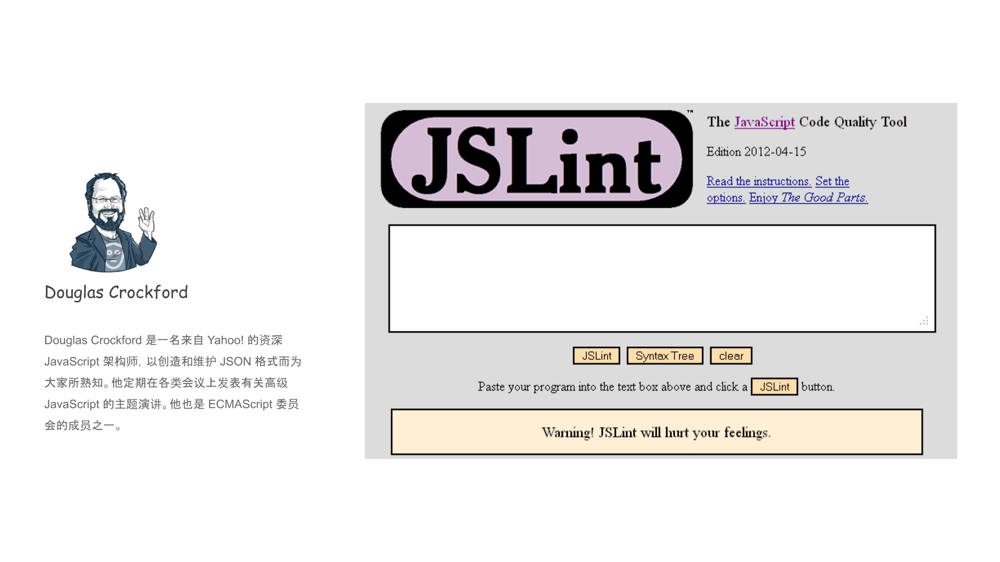

从《JavaScript语言精粹》的书名就可以看出来，全书悉数了 JavaScript 语言的优美特性，同时在书籍的最后面，作者也毫不客气的列举了 JavaScript 的糟粕和鸡肋的地方，从书籍中的笔风就能看出，Douglas 是个眼里容不得瑕疵的人，于是在书籍最后也介绍了作者在 2002 年开发的 JSLint 工具，Douglas 定义了所有 JSLint 的规则，对于糟粕的语法是严格不让使用的，如果你要使用JSLint，就必须接受它所有规则。

#### 继往开来 JSHint

2011 年 12 月 20 日，Anton Kovalyov 发表了一篇标志性的文章：[Why I forked JSLint to JSHint](https://medium.com/@anton/why-i-forked-jslint-to-jshint-73a72fd3612)，指出了 JSLint 存在的几个主要问题：

* 令人不安地固执己见，没有提供一些规则的配置
* 对社区反馈不关注


于是 JSHint 就诞生了，它在 JSLint 的基础上，在社区开发者共同努力下，加入了如下特性：

* 更多可配置的规则，这是社区的核心诉求
* 代码模块化
* 命令行工具的支持，很好得和各种 IDE 集成

诸多优势，让 JSLint 迅速取代 JSHint 成为一种必然。

#### 重新出发 ESLint

JSLint 是从 JSHint 继承而来，所以沿用了 [JSLint Top Down Operator Precedence](http://crockford.com/javascript/tdop/tdop.html)（自顶向下的运算符优先级）技术实现源码的解析，但前端爆发式增长带来的巨大需求让 JSHint 变得愈加难以应对，通过暴露 AST 信息来支持第三方插件无疑是一剂良方。

> AST：[抽象语法树](https://en.wikipedia.org/wiki/Abstract_syntax_tree)

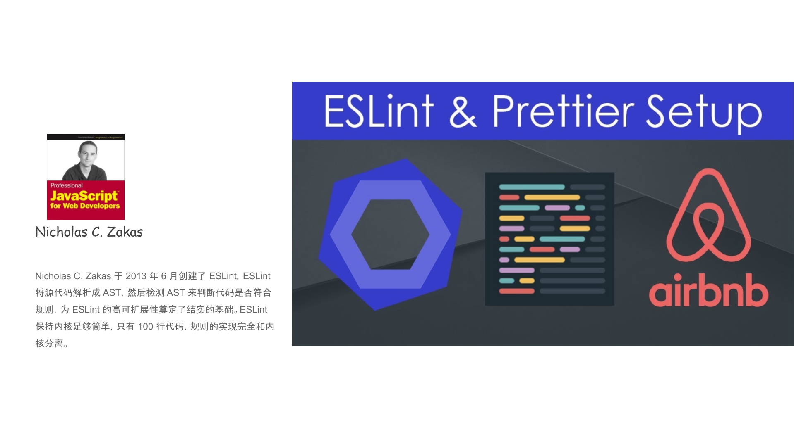

于是《JavaScript 高级程序设计》作者 Nicholas C. Zakas 于 2013 年 6 月创建了 ESLint，ESLint 将源代码解析成 AST，然后检测 AST 来判断代码是否符合规则，为 ESLint 的高可扩展性奠定了结实的基础。ESLint 保持内核足够简单，只有 100 行代码，规则的实现完全和内核分离。

但是，那个时候 ESLint 并没有大火，因为需要将源代码转成 AST，运行速度上输给了 JSHint ，并且 JSHint 当时已经有完善的生态（编辑器的支持）。真正让 ESLint 大火是因为 ES6 的出现。

> 参考[Web：一路前行一路忘川](../history/README.md)中 ES6 的相关内容。

ES6 发布后，因为新增了很多语法，JSHint 短期内无法提供支持，而 ESLint 只需要有合适的解析器就能够进行 lint 检查。这时 Babel 为 ESLint 提供了支持，开发了 babel-eslint，让 ESLint 成为最快支持 ES6 语法的 lint 工具。


## ESLint 怎么用

了解了 ESLint 工具的历史意义和发展过程，接下来看下 ESLint 到底怎么用？

### 给项目安装 ESLint

> 先决条件：Node.js (>=6.14), npm version 3+。

```
// 新建demo工程目录，初始化 npm 项目
npm init

// 安装 eslint    推荐安装为项目的开发依赖
npm i -D eslint

// 初始化 eslint 配置文件    因为不是安装到全局的，所以不能直接使用 eslint --init
./node_modules/.bin/eslint --init
```

在初始化的过程中，会让你选择一些配置，譬如 如何使用 ESLint？我们选择第三项，功能最多。

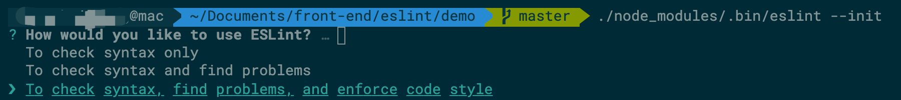

逐一选择完 ESLint 的使用配置后，会在项目根目录生成 `.eslintrc.js` 配置文件，同时会安装需要的 npm 包。 demo 中安装的 npm 包有：

`eslint-config-standard`、`eslint-plugin-import`、`eslint-plugin-node`、`eslint-plugin-promise`、`eslint-plugin-standard`

demo 中选择如下所示：

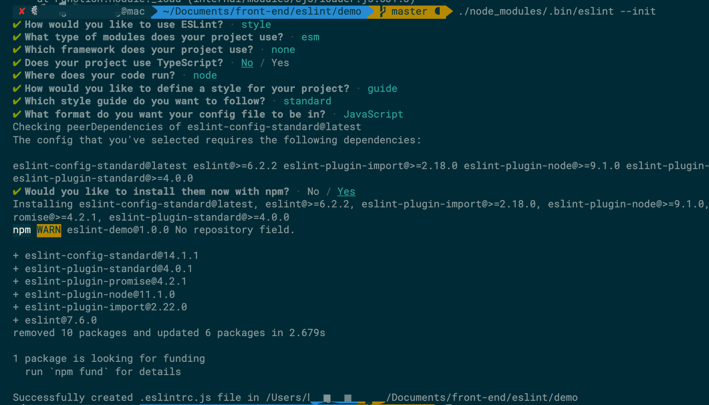

初始化后，生成的配置内容如下所示，具体配置项的含义，后面我们再聊

```js
// .eslintrc.js
module.exports = {
  env: {
    es2020: true,
    node: true
  },
  extends: [
    'standard'
  ],
  parserOptions: {
    ecmaVersion: 11,
    sourceType: 'module'
  },
  rules: {
  }
}
```

**需要强调的是在选择代码风格时，我选择了比较流行的 [standard](https://github.com/standard/standard/blob/master/docs/README-zhcn.md) 规范。**

接下来我们就可以使用 ESLint 来检查和修复代码了。首先在 demo 项目中，新建 src 目录，并新建 index.js 文件，内容如下：

```js
// src/index.js
let a = 10;
let b = 15;
let sum = a + d;
console.log(sum);
```
同时，在 package.json 中，增加 eslint 命令 `eslint src/**` 来检查 src 目录下的所有文件。
```json
//package.json
"scripts": {
  "eslint": "eslint src/**"
}
```

在 demo 目录执行 `npm run eslint` 结果如下：

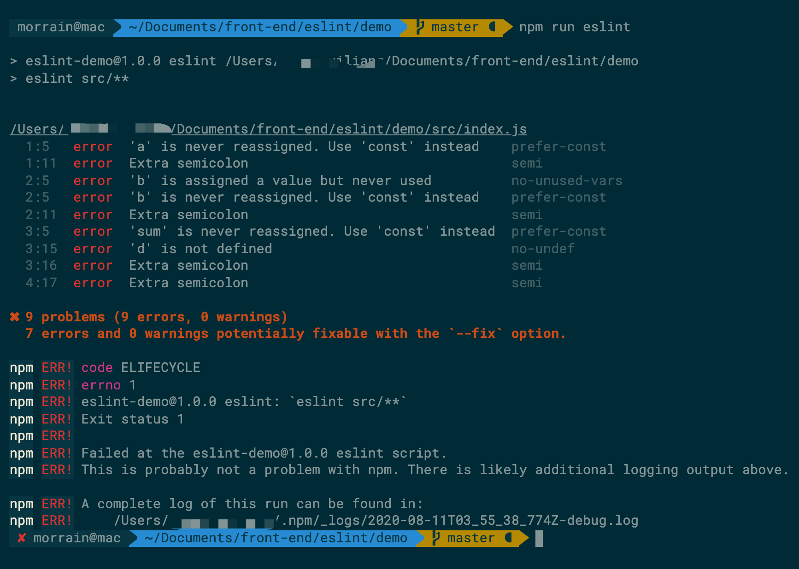

可以看到，检查出来了如此多的错误，其中‘let 要使用 const 替换’，‘不能使用封号’等属于 `standard` 规范中指定的规则，除了风格外，还检查出了‘未定义的变量’等语法错误，并逐一给出提示。

 如果想自动修复检查出来的问题，怎么办呢？ eslint 支持使用 `--fix` 参数。修改 package.json 中的 eslint 命令为 `eslint src/** --fix`

 再次执行 `npm run eslint` 结果如下：

 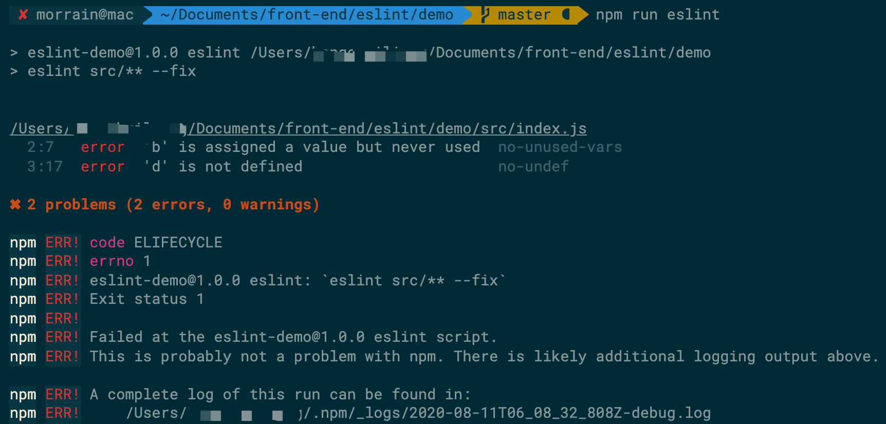

 打开 `src/index.js` 文件发现，内容已经发生了改变：

 ```js
// src/index.js
const a = 10
const b = 15
const sum = a + d
console.log(sum)
```

**可以看到，ESLint 自动修复了可以被修复的风格问题，同时对于不能被自动修复问题给出提示。**

> 更多 eslint cli 配置参数,请参考官网 [cli](https://cn.eslint.org/docs/user-guide/command-line-interface) 的详细介绍。

到这里我们已经‘挖好了护城河’，可是河里并没有水，敌人想要过来依然可以畅行无阻。完全依赖开发人员自觉手动运行 `npm run eslint` 来完成，那怎么样才能让让‘护城河’真正发挥作用呢？我们先看下 ESLint 常见的配置含义，然后在 [如何守住优雅的护城河](#如何守住优雅的护城河)详细介绍。

### 常用配置规则

刚才在初始化之后，在项目根目录生成了 .eslintrc.js 文件，这里存放了所有 eslint 的配置项。

```js
module.exports = {
  env: {
    es2020: true,
    node: true
  },
  extends: [
    'standard'
  ],
  parserOptions: {
    ecmaVersion: 11,
    sourceType: 'module'
  },
  rules: {

  }
}
```

#### 环境与全局变量

demo 中的 env 配置就是为相应的环境定义了一组预定义的全局变量。从之前的例子中我们已经看到，ESLint 会检测出来未定义的变量并报错，但有一些是运行环境或者框架提供的全局变量，譬如 jQuery 提供的 `$`，此时有如下几种解决方案：

1. 在你的 JavaScript 源码文件中，用注释指定全局变量，格式如下：

```js
/* global $ */

const dom = $('id')
```

2. 在配置文件中配置全局变量，将 globals 配置属性设置为一个对象，该对象包含以你希望使用的每个全局变量。对于每个全局变量，将对应的键值设置为 "writable" 以允许重写变量，或 "readonly" 不允许重写变量。例如：

```json
{
    "globals": {
        "$": "readonly"
    }
}
```
3. 使用 env 配置。为了避免上面两种方案需要一一配置每一个全局变量的麻烦，ESLint 预设了好多环境全局变量集合，譬如我们要使用 jQuery 提供的全局变量，只要需要在 env 配置中添加 `jquery:true`就可以了。

demo 中 env 的配置，`es2020:true` 表示增加了 es2020 的语法特性，`node:true` 表示增加 node 中所有的全局变量。更多的环境可以参考官网 [指定环境](https://cn.eslint.org/docs/user-guide/configuring#specifying-environments) 相关章节。

#### 扩展

在 .eslintrc.js 中 rules 用来配置 ESLint 的规则，具体配置规则的方法请参考官网 [如何配置规则](https://cn.eslint.org/docs/user-guide/configuring#configuring-rules) 以及 [所有规则的说明](https://cn.eslint.org/docs/rules/)，这里不作详细介绍，同样为了方便使用，ESLint 使用 `extends` 配置来一次性生效一整套规则。譬如 demo 中 `rules` 中没有配置任何规则，因为通过 `extends` 配置了符合 `standard` 规范的规则集合。

ESLint支持三种类型的扩展：

1. 'eslint:' 开头的 ESLint 官方扩展。包括 `eslint:recommended` 和 `eslint:all`，其中 `eslint:recommended` 是推荐的一套规则，`eslint:all` 是 ESLint 中的所有规则，不推荐使用，因为可能随时被 ESLint 更改。

2. 共享的扩展。通过 npm 包提供一套共享的配置，包名前缀必须为 `eslint-config-`，`extends ` 属性值可以省略包名的前缀 `eslint-config-`。demo 中 `stanard` 对应的就是 package.json 中 'eslint-config-standard' 这个包提供的一套规则。

3. 插件中提供的扩展。在 demo 初始化时，我们可以看到 `eslint-plugin-node` 等插件包被安装，这些插件包是 `eslint-config-standard` 的依赖，所以会被自动安装，这些插件包也提供了一些规则可供扩展。

    譬如如下代码在 node 的模块中写法是错误的，应该写成 `module.exports`，如果想要 ESLint 能检查出这个错误，就需要增加 `eslint-plugin-node` 包中提供的规则到扩展中。

    ```js
    // src/index.js
    exports = {
      foo: 1
    }
    ```
    ```js
    // .eslintrc.js
    extends: [
      'standard',
      'plugin:node/recommended'
    ],
    ```

    > 由于 `eslint-plugin-node` 已经被默认安装了，所以不需要再单独安装，对于没有安装的插件包，如果想使用它提供的规则，需要手动安装这个插件包。

#### 插件

上面讲扩展时，已经提到了如何加载插件中的扩展配置。既然已经有了这么多扩展可以使用，为什么还需要插件呢？因为 ESLint 只能检查标准的 JavaScript 语法，如果你使用 Vue 单文件组件， ESLint 就束手无策了。这个时候，相应框架就会提供配套的插件来定制特定的规则进行检查。插件和扩展类似，也有固定的前缀 `eslint-plugin-`，配置时也可以省略前缀。

我们新加一个 Vue 的单文件组件如下，执行 `npm run eslint` 后发现没有效果，并不能检查 .vue 中的错误，此时就需要安装 `eslint-plugin-vue` 插件。

```html
// src/index.vue
<script>
let a = 10
const b = 15
const sum = a + d
console.log(sum)
</script>
```

```
npm i -D eslint-plugin-vue
```
安装后在 .eslintrc.js 中配置插件，有两种方式

1. 通过 plugins 配置

    ```js
    module.exports = {
      plugins: ['vue']
    }
    ```
    配置完成执行 `npm run eslint` 发现并没有检查 src/index.vue 文件，原来 ` plugins: ['vue']` 只是声明想要引用的 `eslint-plugin-vue` 提供的规则，但是具体用哪些，怎么用，还是需要在 rules 中逐一配置。所以一般我们使用第二种方式配置插件。

2. 通过 extends 配置，即上述的配置扩展的方式。

    ```js
    module.exports = {
      extends: ['plugin:vue/recommended']
    }
    ```
    通过这种方式既加载了插件又指定了使用插件提供的规则，已经能成功检查 vue 文件中上的代码，如下图所示：
    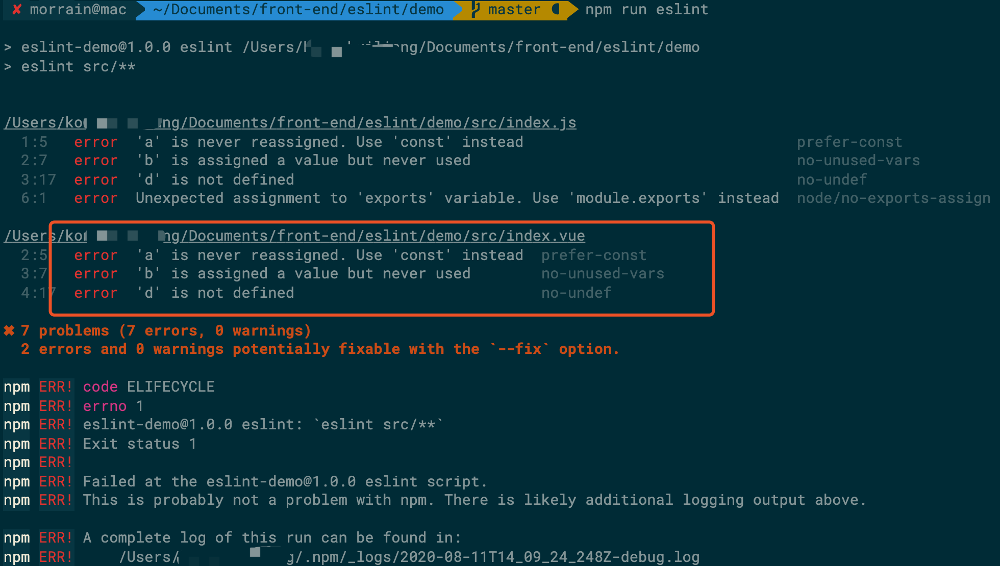

#### 解析器及其配置

```js
module.exports = {
  parserOptions: {
    ecmaVersion: 11,
    sourceType: 'module'
  }
}
```

demo 中 parserOptions 为解析器配置，ESLint 默认只支持 ES5 的语法，但可以通过解析器配置来设置支持的 ES 版本，譬如 demo 中的 `ecmaVersion:11` 表示支持 ES11(即ES2020) 的语法，**这里需要注意的是通过解析器配置只是支持语法，对于该版本新增加的全局变量依然要通过 `env` 配置来完成支持，相关说明以及更多的解析器配置请参考官网 [指定解析器配置](https://cn.eslint.org/docs/user-guide/configuring#specifying-parser-options)** 

ESLint 默认是使用 [ESPree](https://github.com/eslint/espree) 作为其解析器的，但也可以通过 parser 字段指定一个不同的解析器，可以参考官网 [指定解析器](https://cn.eslint.org/docs/user-guide/configuring#specifying-parser)。

那为什么需要指定解析器呢？因为 ESLint 默认的解析器只支持已经形成 ES 标准的语法特性，对于处于实验阶段以及非标准的（譬如 Flow、TypeScript等）需要使用 Babel 转换的语法，就需要指定由 Babel 提供的 `@babel/eslint-parser` 了。由此可见，正常情况下，是不需要指定第三方的解析器的。

以 `@babel/eslint-parser` 为例，当指定它作为 ESLint 的解析器后，我们开发的源码首先由 `@babel/eslint-parser` 根据 Babel 的配置([参考Babel:把 ES6 送上天的通天塔](../babel/README.md)) 把源码转化为 ESLint 默认支持的 AST，并保持住源码的行列数，方便输出错误的定位。 光指定 `@babel/eslint-parser` 还不够，解析器的作用只是负责把 ESLint 不能识别的语法特性转化为 ESLint 能识别的，但它本身不包括规则，还需要使用 `@babel/eslint-plugin` 插件来提供对应的规则，才能正常执行 ESLint 对代码的检测。

> 更多详情，请参考 [@babel/eslint-parser](https://github.com/babel/babel/tree/master/eslint/babel-eslint-parser)  官方文档

至此，常见的配置已经介绍完了，更多配置介绍，请参考 ESLint 官网文档 [配置 ESLint](https://cn.eslint.org/docs/user-guide/configuring)


## 如何守住优雅的护城河

前面也提到了到目前为止，我们只是‘挖好了护城河’，可是河里并没有水，敌人想要过来依然可以畅行无阻。源码检测完全依赖开发人员自觉手动运行 `npm run eslint` 来完成，那怎么样才能让让‘护城河’真正发挥作用呢？

### 享受开发时的乐趣

**首当其冲的需求就是在开发的过程中最好就能做代码检测**，而不是需要代码开发完成后，运行 `npm run eslint` 才能看到错误，此时可能已经一堆错误了。

以 VS Code 编辑器为例（其它编辑器应该也有类似的插件），安装 [ESLint 扩展插件](https://marketplace.visualstudio.com/items?itemName=dbaeumer.vscode-eslint) 。该编辑器插件会读取当前项目中的 .eslintrc.js 的配置，并在编辑器中把不符合规则的错误给提示出来。

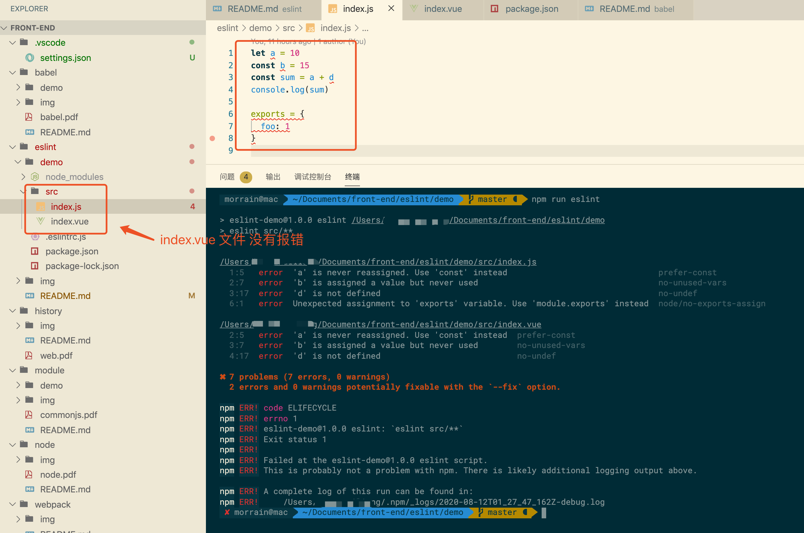

首先可以看到目录树上，有问题的文件变红，点开这个文件，对应的行上也会有错误提示，鼠标停留会提示错误的信息方便修复。但眼尖的同学可能已经发现了，运行 `npm run eslint` 不光能检测 index.js 中的错误，还能检测 index.vue 中的错误，一共是 7 个错误。而编辑器只检测了 index.js 的错误。

**原来是编辑器的 ESLint 插件默认只能检测 .js 的文件，需要调整编辑器 ESLint 插件的设置，让它支持 .vue 文件的检测。** 


如上图所示：

1. 找到插件的设置入口

2. 因为增加对 vue 文件的支持是针对项目的，并不是所有项目都是 vue 项目，所以我们把设置生效到工作区

3. 在 Validata 配置中增加 vue

    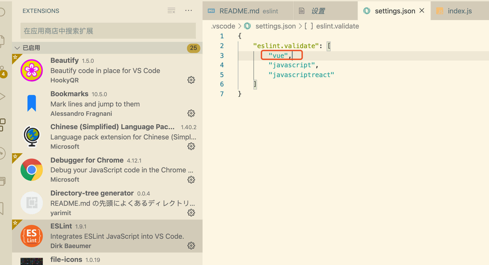

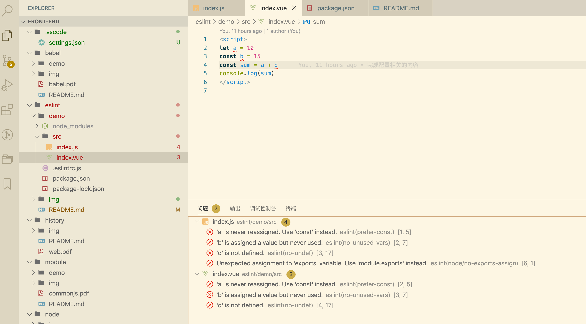

可以看到，index.vue 文件也已经变红，里面的错误也能够被检测了，并且在编辑器的“问题”栏也能显示项目所有的 7 条错误，和运行 `npm run eslint` 效果一样了。

这样一来，开发时就能有错误提示，根据提示修改就好了，但我们之前提到运行 `npm run eslint` 可以通过 `--fix` 参数来自动修复可以修复的问题，譬如格式问题，`let` 改成 `const` 等这些问题。

**那在开发时，是否也可以对于检测出来的错误自动修复呢？**

三种方案，可以根据自喜好选择：

1. 设置保存时自动修复

    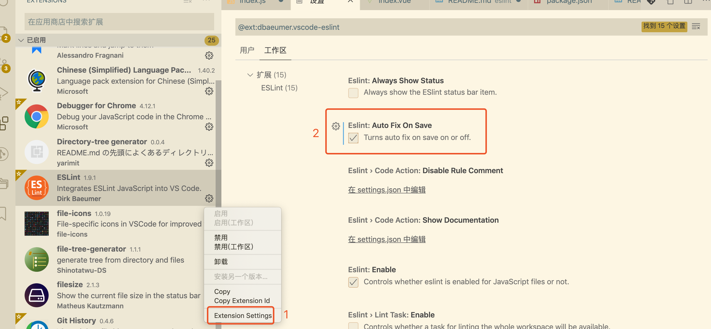

2. 调出 VS Code 编辑器的命令面板，找到 ESLint 插件提供的修复命令

    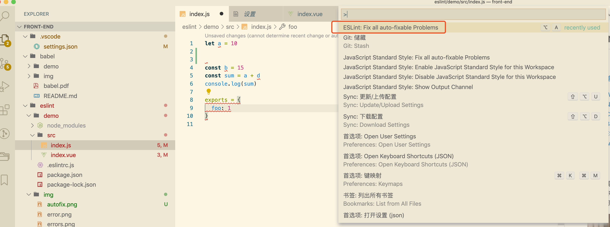

3. 将 ESLint 插件提供的修复命令设置成喜欢的快捷键，使用快捷键修复

此时我们发现，自动修复又是只针对 index.js 文件生效，同样的依然要配置 ESLint 的插件，使其支持 Vue 文件的自动修复功能。

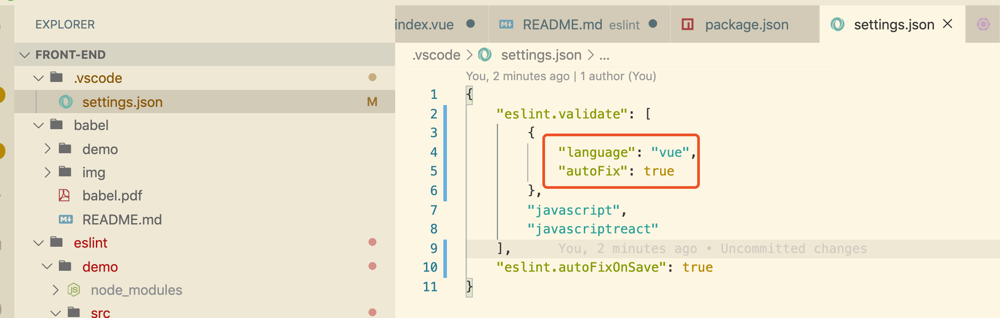

### 将乐趣进行到底

现在我们已经能做到了在开发时检测出来错误并且方便开发人员及时修复问题，但这依赖于开发同学自觉，如果开发同学不自觉或者忘记了，此时提交代码就依然会把错误的代码提交到仓库中去。此时我们需要借助 [husky](https://github.com/typicode/husky#readme) 来拦截 git 操作，在 git 操作之前再进行一次代码检测。

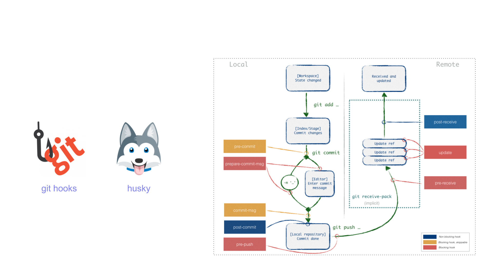

1. 安装并配置 husky

```
npm i -D husky
```

```json
// package.json
{
  "husky": {
    "hooks": {
      "pre-commit": "eslint src/** --fix"
    }
  }
}
```

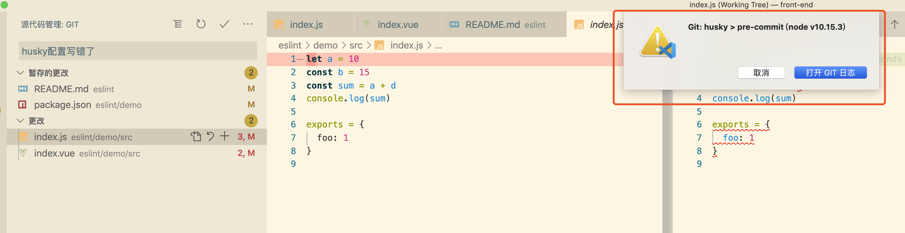

此时提交前会检查 src 下的所有文件，由于 demo 中源码是有问题的，ESLint 检查通不过，所以现在无法提交，从而阻断开发忘记修复 ESLint 检查出来问题的情况。

那对于老的项目，可能已经存在很多遗留的风格问题，导致 ESLint 检查通不过，此时又不可能把所有问题都一一修复掉，全盘阻止提交势必会造成影响。另外对于单次提交而言，如果每次都检查 src 下的所有文件，也是没有必要的。所以我们需要使用 [lint-staged](https://github.com/okonet/lint-staged) 工具只针对当前修改的部分进行检测。

2. 安装并配置 lint-staged

```
npm i -D lint-staged
```

```json
// package.json
{
    "husky": {
    "hooks": {
      "pre-commit": "lint-staged"
    }
  },
  "lint-staged": {
    "*.{js,vue}": [
      "eslint --fix",
      "git add"
    ]
  }
}
```

具体配置请参考 [lint-staged](https://github.com/okonet/lint-staged) 官网文档。示例中配置表示的是，对当前改动的 .js 和 .vue 文件在提交时进行检测和自动修复，自动修复完成后 add 到 git 暂存区。如果有无法修复的错误会报错提示。

### 安装“黑匣子”

飞机上都装有黑匣子，当出现故障时，可以很方便的回溯航行记录，发现问题。我们的代码仓库也一样，每次提交都应该有记录。但每个开发同学提交时输入的信息各不一样，没有统一的格式，导致后面回溯提交记录时眼花缭乱，效率很低。

接下来看下，如何约束提交，来守住优雅得提交日志这道大门。


[commitizen](https://github.com/commitizen/cz-cli) 是用来格式化 git commit message 的工具，它提供了一种问询式的方式去获取所需的提交信息。

[cz-conventional-changelog](https://github.com/commitizen/cz-conventional-changelog) 是用来规定提交时需要输入哪些信息，譬如提交的类型是修复问题还是功能开发，提交影响范围等等，cz-conventional-changelog 是官网提供的规则，完全可以根据项目实际情况自已开发适合的规则。

[standard-version](https://github.com/conventional-changelog/standard-version) 提交信息并约束后，提交的日志信息就会比较统一，使用 standard-version 很容易自动生成提交的日志 CHANGELOG 文件

1. 安装并配置

```
npm i -D commitizen cz-conventional-changelog standard-version
```

```json
//package.json
{
  "scripts": {
    "c": "git-cz",
    "version": "standard-version"
  },
  "standard-version": {
    "changelogHeader": "# Changelog\n\n所有项目的变更记录会记录在如下文件.\n",
    "dryRun": true
  },
  "config": {
    "commitizen": {
      "path": "cz-conventional-changelog"
    }
  }
}
```

配置完成后，使用 `npm run c` 来提交修改，会如现如下图所示的问询式的交互提示，根据规则要求填写对应的内容就好了。

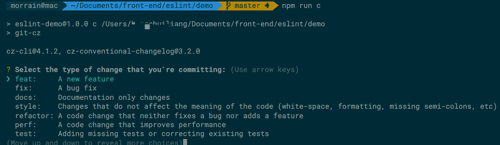

通过此方式提交，提交的日志是格式统一的，然后就是使用 `npm run version` 来生成 CHANGELOG 文件了。

standard-version 会自动 bump 项目的版本号，并生成两个版本之间的提交日志记录文件，然后打个版本 tag 上传到仓库。更多关于 standard-version 的功能请参考官网文档 [standard-version](https://github.com/conventional-changelog/standard-version) 

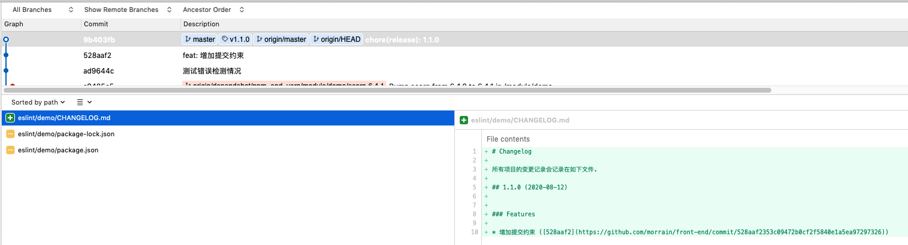


### 最后一道防线

现在开发如果使用 `npm run c` 来提交修改，那么一切都会非常美好，可是万一开发忘了使用 `npm run c` 来提交修改，直接使用 git 命令，或者其它工具提交改动，怎么办？如何守好最后一道防线？

答案就是在提交时对提交信息进行校验，如果不符合要求就不让提交，并提示。校验的工作由 [commitlint](https://github.com/conventional-changelog/commitlint) 来完成，校验的时机则由 [husky](https://github.com/typicode/husky#readme) 来指定。 husky 继承了 Git 下所有的钩子，在触发钩子的时候，husky 可以阻止不合法的 commit，push 等等。

1. 安装并配置

    ```
    // 安装工具包
    npm install --save-dev @commitlint/{config-conventional,cli}

    // 生成 commitlint 配置文件 
    echo "module.exports = {extends: ['@commitlint/config-conventional']}" > commitlint.config.js
    ```

    `@commitlint/cli` 用来执行检查，`@commitlint/config-conventional` 是检查的标准，即提交的信息是否符合这个标准的要求，只有符合要求才允许提交。

    生成配置文件，指定要使用的规范，同时增加 husky 中的 'commit-msg' 钩子。配置完成后，再通过非 `npm run c` 途径的提交都会被拦截并报错。 

    ```json
    // package.json
    {
      "husky": {
        "hooks": {
          "pre-commit": "lint-staged",
          "commit-msg": "commitlint -E HUSKY_GIT_PARAMS"
        }
      }
    }
    ```

2. 错误提交时的校验

    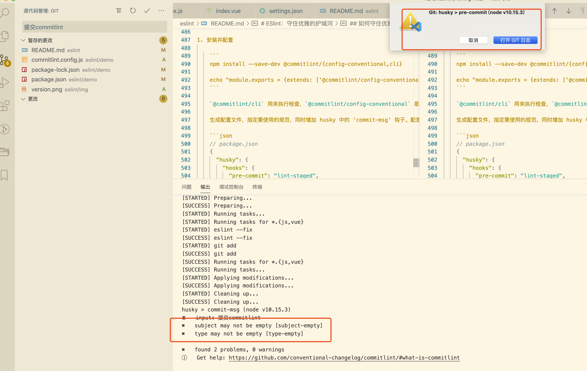

## 总结

**基于 ESLint ，我们成功化身为程序员界的‘革离’，守好了我们的战场，让属于我们的天空之城干净纯粹、整齐划一，在优雅里翱翔！**

下一节，我们聊聊打包工具 webpack


## 参考文献

[深入理解 ESLint](https://juejin.im/post/6844903901292920846)

[ESLint 官网](https://cn.eslint.org/)

[JS Linter 进化史](https://zhuanlan.zhihu.com/p/34656263/)

《JavaScript语言精粹》

[ESLint 工作原理探讨](https://zhuanlan.zhihu.com/p/53680918)


