# Web：一路前行一路忘川

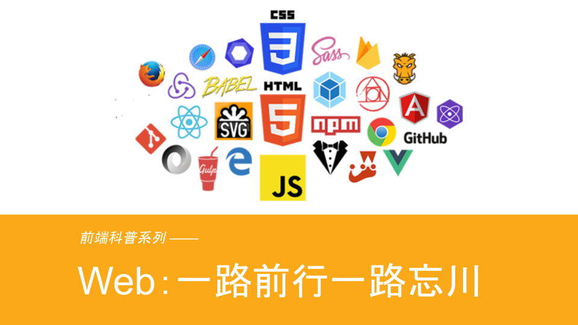

[本文配套PPT](./ppt.pdf)

- [Web：一路前行一路忘川](../history/README.md)
- [Node.js：换个角度看世界](../node/README.md)
- [CommonJS：不是前端却革命了前端](../module/README.md)

## 什么是前端

---

回答这个问题之前，我想起了一道非常经典的前端面试题：“从输入URL到页面呈现在你面前到底发生了什么？”这个题目可以回答的很简单，但仔细思考，也可以回答得很深，这个过程涉及的东西很多。先看一张图：

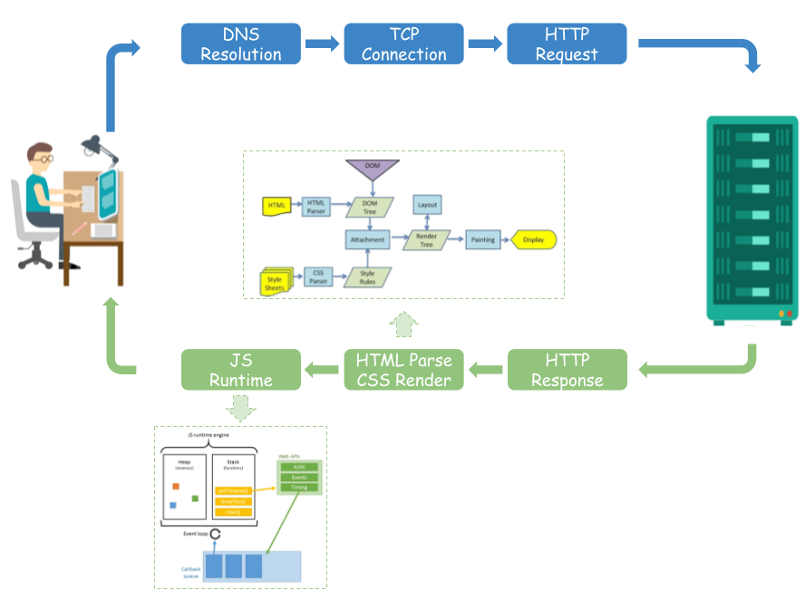

简单说就是

1. DNS (Domain Name System) 解析
2. TCP (Transmission Control Protocol) 链接
3. HTTP (HyperText Transfer Protocol) 请求
4. HTTP 响应
5. HTML解析 & CSS渲染
6. JS 解析执行

为什么提这个呢，因为这是一整个web服务生命周期的全过程，而在最早的时候是根本没有前端或者后端的概念的，当时就是用 Dreamweaver 写 `html` 静态页面，然后部署到一台电脑的 IIS (Internet Information Services) 上，当请求这个页面时，返回这个 `html` 文件。再后面一点，服务端变得复杂了一些，`html` 页面开始使用各种模板来写，譬如 `Java` 系列的 `FreeMarker`，还有 `ASP` 、 `PHP` 等等。 此时，前后端开发是一体的，最多也就是模板的编写算是最初的前端范畴，但那个时候，这个活儿往往都是现在的后端开发去干的。

下面是一个比较典型的 `PHP` 的模板：

```html
<html>
  <head><title>Car {{ $car->id }}</title></head>
  <body>
    <h1>Car {{ $car->id }}</h1>
    <ul>
      <li>Make: {{ $car->make }}</li>
      <li>Model: {{ $car->model }}</li>
      <li>Produced on: {{ $car->produced_on }}</li>
    </ul>
  </body>
</html>
```

---

随着 2005年 Ajax (`Asynchronous JavaScript and XML`) 的诞生，彻底得改变了这一切，`JS` 脚本可以独立向服务器请求数据，拿到数据后，进行处理并更新网页，这个过程中，后端只负责提供数据，其他事情都由前端来做，就是从这个时期开始，前端逐渐变得复杂，也是从在这个时期开始，设计师和后端开发已经开始放弃前端了，开发的岗位角色悄悄地发生了变化：

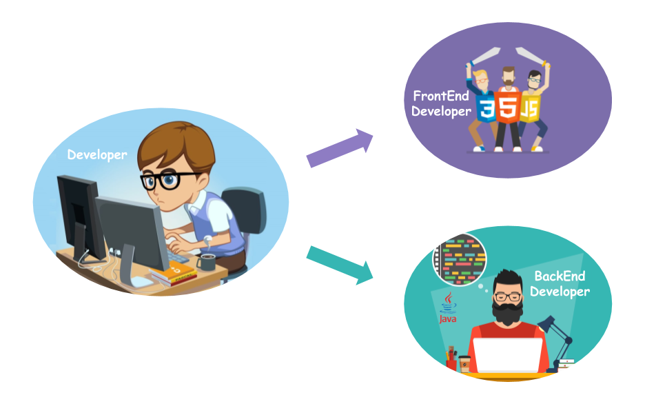

聊到现在，什么是前端的问题应该呼之欲出了:

- **前端： 针对浏览器的开发，代码在浏览器中运行**
- **后端： 针对服务器的开发，代码在服务器中运行**

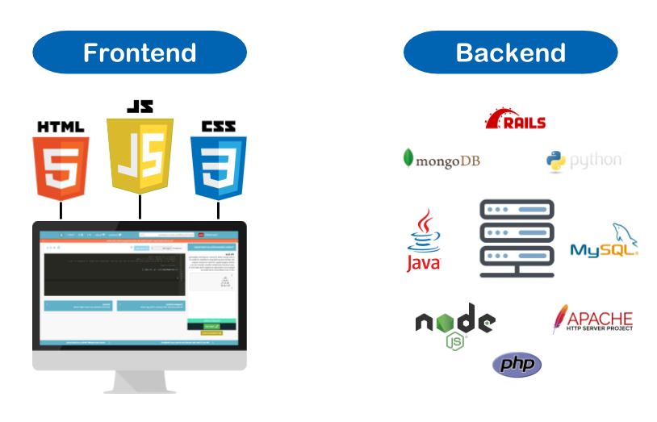

可以说 Ajax 的出现是前端岗位出现的转折点，但并不是前端的起点，前端的起点，我们稍后聊 `JavaScript` 的历史会聊到。

---

既然前端是针对浏览器的开发，那一个页面呈现出来，在浏览器里做了什么呢？

浏览器收到服务器响应的 `HTTP` 报文后，边解析边渲染。首先浏览器解析 `html` 文件构建 `DOM` 树，然后解析 `CSS` 文件构建渲染树，等到渲染树构建完成后，浏览器开始布局渲染树并将其绘制到屏幕上。除了表现之外，我们还需要与页面交互，所以离不开 `JS`，而 `JS` 的解析和运行是由浏览器中的 `JS` 引擎来完成，最有名的就是2008年由 Google 发布的 V8。

所以，跑在浏览器的代码无外乎这三种：**`HTML` + `CSS` + `JS`**

**`HTML(HyperText Markup Language)`** 全称是超文本标记语言，它不是一门编程语言，而是一种用来告知浏览器如何组织页面的标记语言。它由一系列的元素（elements）组成，这些元素可以用来包围不同部分的内容，使其以某种方式呈现或者工作。


我们在浏览器中任意打开一个页面的源码，都会看到类似如下的内容：

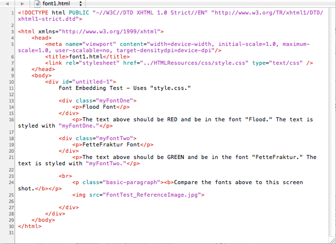

**`CSS(Cascading Style Sheets)`** 全称是层叠样式表，它是用来样式化和排版网页的 —— 例如更改网页内容的字体、颜色、大小和间距，将内容分割成多列或者加入动画以及别的装饰型效果。它通过选择器选中上面提到的 `HTML` 元素，然后为选中的元素添加颜色，间距等样式。如下所示：


每一个有追求有品味的页面，都在借 `CSS` 给浏览者说一句话："**我怎么这么好看！**"


**`JS(JavaScript)`**  是一种具有函数优先的轻量级、解释型编程语言。它因互联网而生，紧跟着浏览器的出现而问世。**它是一门计算机语言**，随着前端的迅猛发展，它已经不像刚开始出现时那样，只是为了做了一些页面的校验，已经成了构建企业级应用的重要语言之一，目前在全球范围的使用情况排名第三。

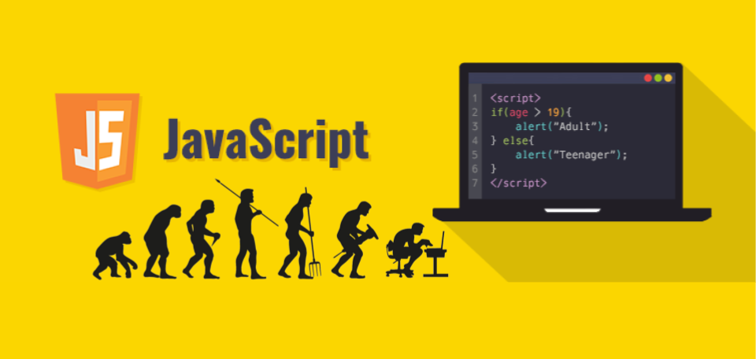

如果用一个人来作比喻网页的话，`HTML` 就是一个人的骨骼， `CSS` 就是一个人的血肉，而 **`JS` 则是一个人的灵魂**！

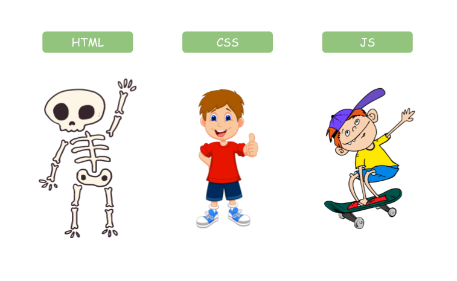

> 当然随着V8的诞生以及Node的问世，让 `JavaScript` 可以跑在非浏览器中，进一步拓展了前端的范畴，下一节我们聊这方面的事情。

---

**前端开发工程师** 是近十年随着前端发展才真正开始受到重视的一个新兴职业。刚才我们提到前端的三个组成部分：**`HTML` + `CSS` + `JS`**，这三个部分看起来听起来都感觉很简单，也正因为如此，前端开发领域有很多自学成“才”的同行，我甚至在校招面试时听到候选人说是因为觉得后端太难，其它岗位面试通不过才选择前端的。确实，前端开发的入门门槛低，与后端语言先慢后快的学习曲线相比，前端开发的学习曲线是先快后慢，后面的学习曲线越来越陡峭，每前进一步都很难，导致大多数前端开发都停留在初级阶段。

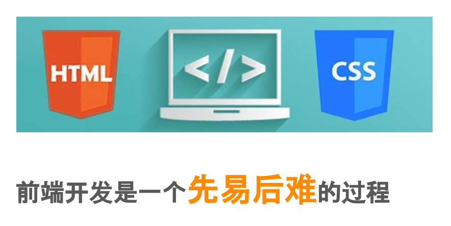

目前，前端开发工程师主要分布在这些地方：

- 大公司
  - 互联网公司
  - 传统行业
- 创业公司
- 自由职业
  - 外包、自己接项目
  - 行业大牛


创业公司的特点是开发团队人数不多，但有一个共同点：技术leader是从大公司历练出来的，因为船小好掉头的原因，往往技术的实效性要比大型互联网公司好一些。
而大型互联网公司的特点是体系、流程很完善(久经考验的)，服务的用户、体量都非常大，部门人数多、协同开发的机制很完善，内部不缺比你牛逼的人，身边的同事都不是特别菜的，可能最菜的就是你自己。

## JavaScript 语言的历史

---

JS 作为网页的灵魂，它是前端开发中最重要的一部分，所以接下来我们来看看 JavaScript 作为一门计算机语言是怎么诞生的，又经历了怎么样的发展。

**1990年12月**，欧洲核子研究中心（CERN）的科学家 Tim Berners-Lee 发明了万维网（World Wide Web），今年的3月12日，欧洲核子研究中心还举办了系列活动，庆祝万维网发明三十周年。当时的网页还只能在操作系统的终端里浏览，也就是说只能使用命令行操作，网页内容都是在字符窗口中显示，这当然非常不方便。

>  1994年5月中科院高能物理研究所计算中心的许榕生研究员去 CERN 参加了由380人参加的第一届国际 WWW 大会。会后，他带领一批年轻人很快在高能所计算中心的一台 PC 机上用 Linux 创建了中国第一个 WWW 服务器，并推出第一个网站 `www.ihep.ac.cn` (这个域名现在还在使用) 和英文网页（IHEP/China Home Page），该网站成为当时亚洲少数几个网站之一。

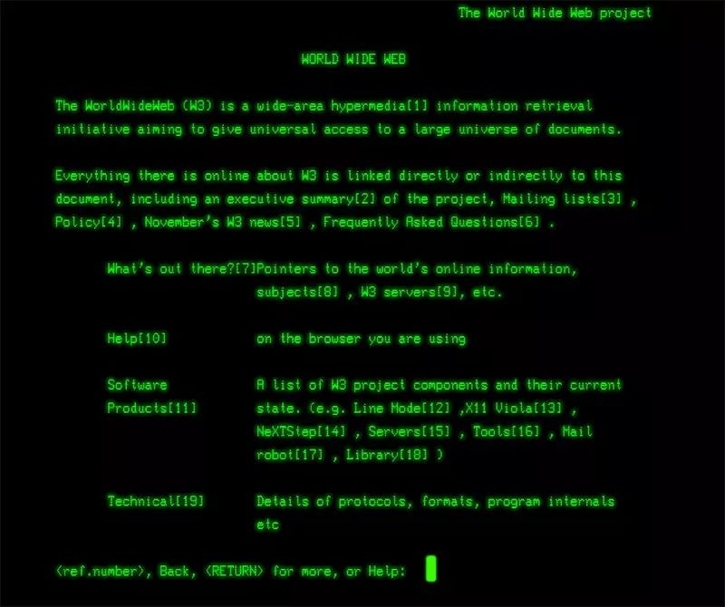

**1992年底**，美国国家超级电脑应用中心（NCSA）开始开发一个独立的浏览器，叫做 Mosaic。这是人类历史上第一个浏览器，从此网页可以在图形界面的窗口浏览。Mosaic 是后来大家耳熟能详的网景浏览器（Netscape Navigator）的前身。那时候还没有 Ajax，所以用户每次操作，都会重新加载整个页面，于是 Netscape 公司很快就发现一个问题，如果用户还没有输入内容，就点了“发送”摁钮，服务器发现后把整个页面重新返回给客户端，仅仅只是在页面中添加了一个错误提示，那个时代网速很慢上网很贵，到服务器才发现这一点很明显太晚了，最好能在用户发出数据之前，就告诉用户“请填写内容”。这就需要在网页中嵌入小程序，让浏览器检查每一栏是否都填写了。

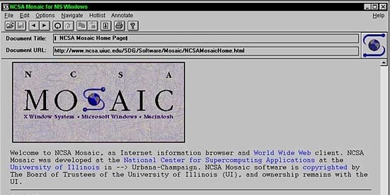


**1995年4月**，Netscape 公司雇佣了程序员 Brendan Eich 开发这种网页脚本语言，Brendan Eich 只用了10天，就设计完成了这种语言的第一版，最初名字叫做 Mocha，1995年9月改为 LiveScript。12月，Netscape 公司与 Sun 公司（Java 语言的发明者和所有者）达成协议，后者允许将这种语言叫做 JavaScript。这样一来，Netscape 公司可以借助 Java 语言的声势，而 Sun 公司则将自己的影响力扩展到了浏览器。实际上 JavaScript 与 Java 没啥太大关系！


**1996年8月**，微软模仿 JavaScript 开发了一种相近的语言，取名为JScript（JavaScript 是 Netscape 的注册商标，微软不能用），首先内置于IE 3.0。Netscape 公司面临丧失浏览器脚本语言的主导权的局面。于是，Netscape 公司在1996年11月决定将 JavaScript 提交给国际标准化组织 ECMA (European Computer Manufacturers Association), 希望 JavaScript 能够成为国际标准，以此抵抗微软。

**1997年7月**，ECMA 组织发布262号标准文件（ECMA-262）的第一版，规定了浏览器脚本语言的标准，并将这种语言称为 ECMAScript。之所以不叫 JavaScript，一方面是由于商标的关系，Java 是 Sun 公司的商标，根据一份授权协议，只有 Netscape 公司可以合法地使用 JavaScript 这个名字，且 JavaScript 已经被 Netscape 公司注册为商标，另一方面也是想体现这门语言的制定者是 ECMA，不是 Netscape，这样有利于保证这门语言的开放性和中立性。因此，ECMAScript 和 JavaScript 的关系是，前者是后者的规格，后者是前者的一种实现。在日常场合，这两个词是可以互换的。

接下来的两年，连续发布了 ECMAScript 2.0（1998 年 6 月）和 ECMAScript 3.0（1999 年 12 月）。3.0 版是一个巨大的成功，在业界得到广泛支持，成为通行标准，奠定了 JavaScript 语言的基本语法，以后的版本完全继承。**直到今天，初学者一开始学习 JavaScript，其实就是在学 3.0 版的语法**。

**2000年**，ECMAScript 4.0 开始酝酿。这个版本最后没有通过，但是它的大部分内容被 ES6 继承了。因此，ES6 制定的起点其实是 2000 年。为什么 ES4 没有通过呢？因为这个版本太激进了，对 ES3 做了彻底升级（也就是现在的ES6），引来了以 Yahoo、Microsoft、Google 为首的大公司的强烈反对，ECMA 开会决定，中止 ECMAScript 4.0 的开发。

> 只有 JavaScript 的创造者 Brendan Eich 所在的 Mozilla 公司 坚持ES4的草案，有时候要创点新真得不容易！

**2015年6月**，ECMAScript 6 正式发布，并且更名为“ECMAScript 2015”。虽然从ES3之后，陆续发了 ES5 以及 ES5.1，但都是涉及现有功能改善的一小部分。

对于前端开发来说，接受并熟悉 ES6 是比较困难的，毕竟当年 Google 就接受不了，何况 ES6 是集过去15年的精华于一身。

## Web开发技术演进

---

聊完 JavaScript 的历史，我们可以看到，它并不随前端的发展呈正相关，因为它在很长一段时间，并没有什么变化。所以接下来聊聊前端技术演进的历史，看看这些年前端都发生了什么。

### Web 2.0

前面提到的 2005 年诞生的 Ajax，促进了前后端的分离。其实是在这一年谷歌发布了测试版本的谷歌地图，并在这个项目大量运用让网页透过 Javascript 以 XML 格式来回传数据、达到异步更新网页内容的技术，这在当时是一个跨时代的壮举，让用户终于有机会看到不需要刷新整个页面就可以更新状态的地图，我们也看到了异步操作是如何给网站用户带来良好体验的。

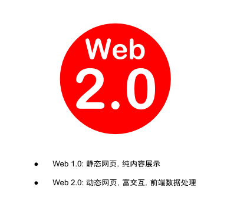

不夸张的说，这一年算得上是 Web 开发技术发展的元年。Web也从 1.0 的时代，步入 2.0 的时代。

### MVC (model-view-controller)

前端可以通过 Ajax 获取数据，因此也就有了处理数据的需求，于是就促使了前端 MVC 的诞生。

我第一个前端项目就是使用 MVC 模式做的，使用的是 ExtJs，它曾经是一个很好的企业级 Web 富客户端应用开发平台，它做出来的页面效果特别酷炫。如下图所示：


而我在做这个项目时就应用了 MVC 的模式。

- 视图（View）：用户界面
- 控制器（Controller）：业务逻辑
- 模型（Model）：数据模型

View 作为用户界面，发送指令给 Controller，Controller 要求 Model 改变状态，同时 Model 把更新过的数据发送给 View 反馈给用户。

MVC 模型最核心的一点就是 **所有通信都是单向的**

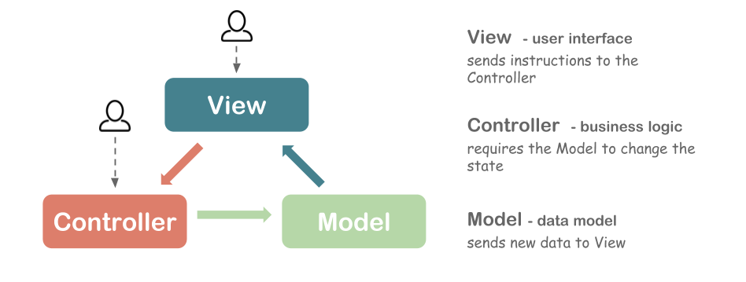

其实生活当中，MVC 的设计思想很多地方都有所体现，以家用微波炉为例，可以将它也理解成三层结构。微波炉的外观以及上面的操作摁钮就是"视图层"（view），而其内部的微波产生装置磁控管则是"数据层"（Model），这里的"数据"可以理解成"核心功能"。把操作摁钮的指令转化为对磁控管的操作则是由“控制器层”的电路板来实现的。

如果现在要给微波炉更换一个新潮的外壳，或者更换一个更大功率的磁控管，完全可以在不更改其他层的情况下实现。**每一层都是独立的，这就是 MVC 模式的最大优势。**


在这个阶段的后期，前端逐渐开始有了一点工程化的影子，并且开始受 CommonJS 的影响，有了模块化编程的概念，诞生了相应的 CMD 和 AMD 的规范。开始有了构建工具 Grunt/Gulp，开始有了编码的规范 JsLint。

### MVVM (Model-View-ViewModel)

MVVM 同样是一种软件架构模式，它是在 MVC 的基础上演进过来的，去掉了 MVC 中的 Controller，增加了数据的双向绑定。

最有代表性的框架就是 Google 公司推出的 Angular， 它的风格属于 HTML 语言的增强，核心概念就是数据双向绑定。


Vue也可以算是 MVVM 模型，虽然它没有完全遵守 MVVM 的设计，但受到了 MVVM 的启发，在最开始的时候也是双向数据绑定，并且一直使用 vm 表示 View-Model。就以 Vue为例，简单看下 MVVM 的思想。 

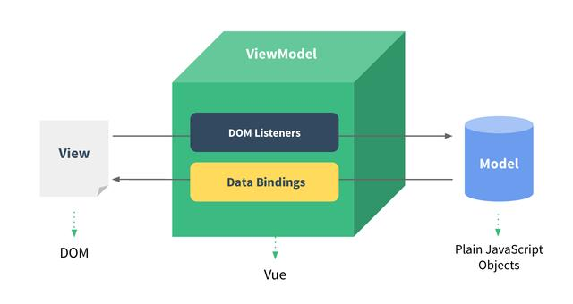

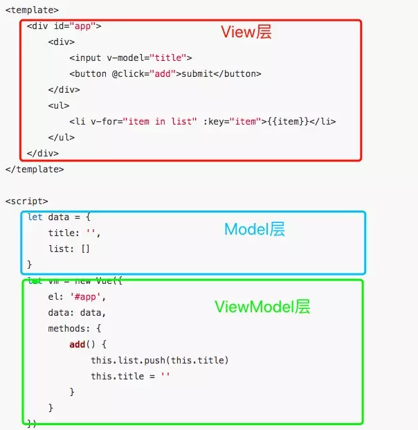


### SPA (single-page application)

SPA 是单页应用的意思，它是区分传统模式而言的。我们一开始就探讨过从输入URL到页面呈现在我们面前的过程，也熟悉了 `HTML` 、 `CSS` 和 `JS`。现在换个角度来看这个过程：

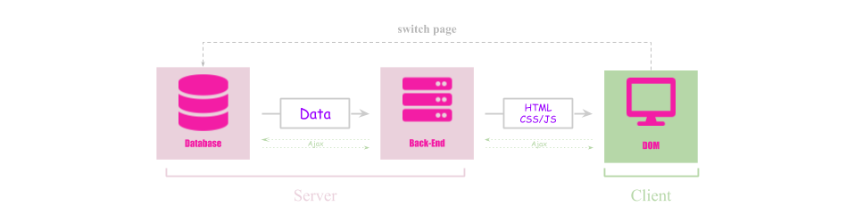

当客户端发起页面请求后，后端收到请求，然后取出数据库中的数据，组装好 `HTML`，然后返回 `HTML` 、 `CSS` 和 `JS`。有了 Ajax 后，我们在当前页面可以重新获取数据，并更新页面内容。但当我们切换页面，也就是有页面跳转时，整个过程会从头再来一次。精益求精的前端开发者们这个时候就在考虑，既然 Ajax 可以在当前页面获取数据并随时更新当前页面，**那是不是可以做到切换页面时也只通过 Ajax 获取数据更新页面，而不全部重新加载呢？**

答案当然是可以！如下图所示，用户第一次发起页面请求时，后端收到请求，然后取出数据库中的数据，返回 `CSS` 和 `JS`文件，`JS` 文件包括了页面切换逻辑的处理，这是单页应用实现的关键，它利用 Hash 或者 History 的技术，实现了当切换页面时，首先通过 Ajax 获取到新页面需要的数据，然后由 `JS` 根据要切换到的网址，使用获取到的数据来拼接出要展示页面的 `HTML`。整个切换页面的动作全部由前端来完成了。这就是单页应用，所有的资源只在第一次页面请求时被加载，后面都只会发起 Ajax 请求获取数据而已。

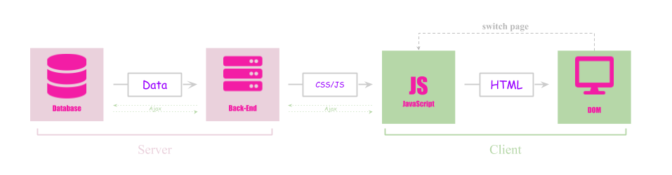

### SSR (server side render)

SPA 让 web 变成了应用的形态，它是客户端渲染（client side render）。客户端渲染有它的弊端，譬如没法做 SEO(Search Engine Optimization)，由于所有的 `JS` 和 `CSS`会在首次访问时被全部加载，并且 `HTML` 是在前端组装的，就势必导致首屏加载以及渲染的时间会增加，影响用户体验。


于是，现在又争先恐后的回到服务端渲染，想想真得挺可笑的，十年前为了搭上 Ajax 的班车纷纷做SPA，做客户端渲染，现在反而又想着法儿的要重新做服务端渲染。

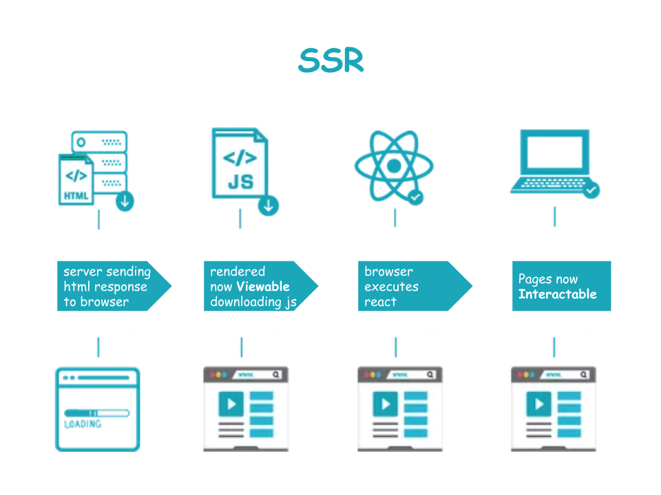

其实本质是一样的，所以这里其实是有历史包袱的，在项目开始之前，先想想清楚到底有没有必要做成 SPA 比较重要，而不是一味的趋之若鹜。

当然现在的服务端渲染和之前的服务端渲染在形式上还是有区别的：

之前的服务端渲染基本是围绕页面为中心的开发模式，只需要处理 模板-> `html`字符串的转换，性能要优于现在的服务端渲染

现在的服务端渲染基本是围绕组件为中心的开发模式，开发效率和可维护性当然更高，组件也可以统一通过模块构建工具如webpack一并处理。

有一些 web 应用如果就应该使用 SPA 模式，但又想要 SEO 怎么解决呢？

当搜索引擎的网络爬虫过来的时候，其实是可以通过头信息判断的，于是有一种创新的解决方案，可以在中间层写个服务，对请求进行拦截，譬如 Rendora 就是解决这个问题的，之前写好的项目一句不用改，只需新起 Rendora 服务，对于爬虫的请求额外增加服务端渲染，返回生成好的 `html` 就好了，对于非爬虫，之前该怎么玩儿就怎么玩儿。

### Node & 全栈

2009年，Node 项目诞生，它是服务器上的 JavaScript 运行环境。Node的出现令前端开发拥有了控制服务器的能力：

Node = JavaScript + 操作系统 API

下一节聊聊 Node

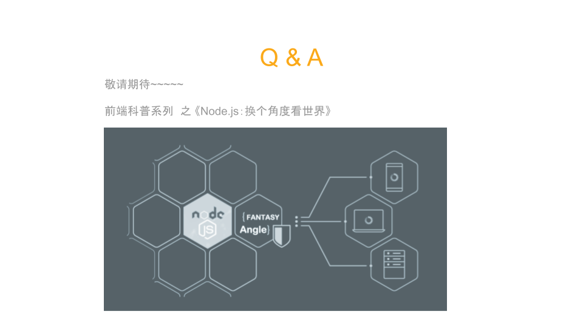

## 参考文献

[JavaScript 语言的历史](https://wangdoc.com/javascript/basic/history.html)

[大前端的技术原理和变迁史](https://juejin.im/post/5b5adc9b6fb9a04f9244555d)

[History of front-end frameworks](https://logrocket.com/blog/history-of-frontend-frameworks/)

[WEB前端发展史](https://mp.weixin.qq.com/s/gNtpdMRL6JqNMr_tJsCVdA)

[万维网 WWW 的三十年](https://www.linkresearcher.com/information/cb9aadac-a124-4708-b4f7-ecb4fd804bdb)

[MVC，MVP 和 MVVM 的图示](http://www.ruanyifeng.com/blog/2015/02/mvcmvp_mvvm.html)

