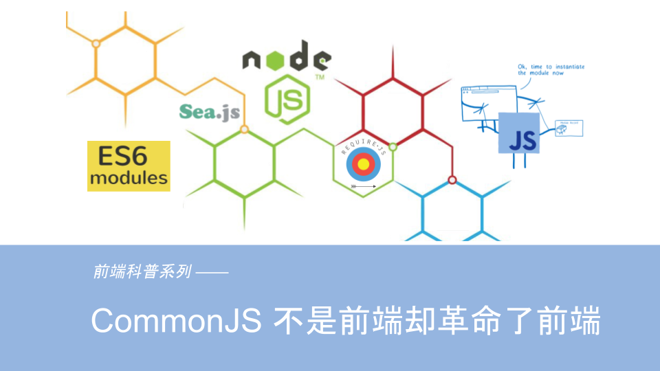
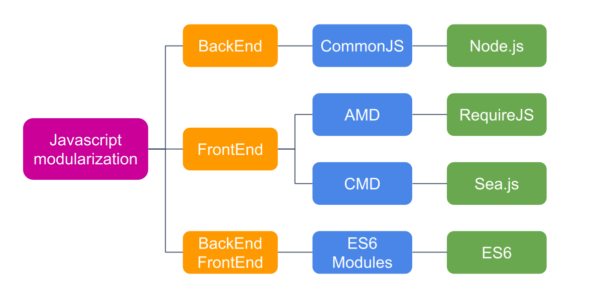
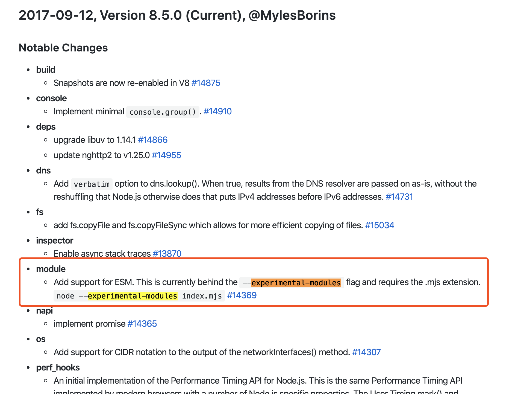
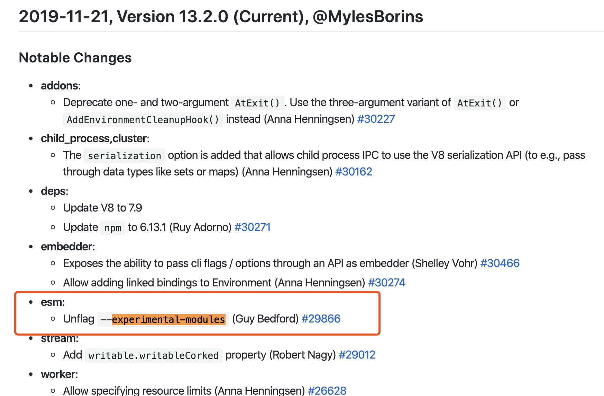

# CommonJS：不是前端却革命了前端



- [前端简史](../history/README.md)
- [Node.js 换个角度看世界](../node/README.md)
- [CommonJS：不是前端却革命了前端](../module/README.md)

## 前言

上一节《Node.js 换个角度看世界》，我们聊了 Node.js 相关的东西，Node.js 能在诞生后火到如此一塌糊涂，离不开它成熟的模块化实现，Node.js 的模块化是在 CommonJS 规范的基础上实现的。 那 CommonJS 又是什么呢？

先来看下，它在[维基百科](https://zh.wikipedia.org/wiki/CommonJS)上的定义：

> CommonJS 是一个项目，其目标是为 JavaScript 在网页浏览器之外创建模块约定。创建这个项目的主要原因是当时缺乏普遍可接受形式的 JavaScript 脚本模块单元，模块在与运行JavaScript 脚本的常规网页浏览器所提供的不同的环境下可以重复使用。

我们知道，很长一段时间 JavaScript 语言是没有模块化的概念的，直到 Node.js 的诞生，把 JavaScript 语言带到服务端后，面对文件系统、网络、操作系统等等复杂的业务场景，模块化就变得尤为重要。于是 Node.js 和 CommonJS 规范就相得益彰、相映成辉，共同走入开发者的视线。

由此可见，CommonJS 最初是服务于服务端的，所以我说 CommonJS 不是前端，但它的载体是前端语言 JavaScript，为后面前端模块化的盛行产生了深远的影响，奠定了结实的基础。CommonJS：不是前端却革命了前端!

## 为什么需要模块化

### 没有模块化时，前端是什么样子

在之前的《前端简史》中，我们提到过 JavaScript 诞生之初只是作为一个脚本语言来使用，做一些简单的表单校验等等。所以代码量很少，最开始都是直接写到 `<script>` 标签里，如下所示：

```html
// index.html
<script>
var name = 'morrain'
var age = 18
</script>
```

随着业务进一步复杂，Ajax 诞生以后，前端能做的事情越来越多，代码量飞速增长，开发者们开始把 JavaScript 写到独立的 js 文件中，与 html 文件解耦。像下面这样：


```js
// index.html
<script src="./mine.js"></script>

// mine.js
var name = 'morrain'
var age = 18
```

再后来，更多的开发者参与进来，更多的 js 文件被引入进来:

```html
// index.html
<script src="./mine.js"></script>
<script src="./a.js"></script>
<script src="./b.js"></script>
```
```js
// mine.js
var name = 'morrain'
var age = 18

// a.js
var name = 'lilei'
var age = 15

// b.js
var name = 'hanmeimei'
var age = 13
```

不难发现，问题已经来了！ JavaScript 在 ES6 之前是没有模块系统，也没有封闭作用域的概念的，所以上面三个 JavaScript 文件里申明的变量都会存在于全局作用域中。不同的开发者维护不同的 JavaScript 文件，很难保证不和其它 JavaScript 文件冲突。全局变量污染开始成为开发者的噩梦。

### 模块化的原型

为了解决全局变量污染的问题，开发者开始使用命名空间的方法，既然命名会冲突，那就加上命名空间呗，如下所示：

```html
// index.html
<script src="./mine.js"></script>
<script src="./a.js"></script>
<script src="./b.js"></script>
```
```js
// mine.js
app.mine = {}
app.mine.name = 'morrain'
app.mine.age = 18

// a.js
app.moduleA = {}
app.moduleA.name = 'lilei'
app.moduleA.age = 15

// b.js
app.moduleB = {}
app.moduleB.name = 'hanmeimei'
app.moduleB.age = 13

```
此时，已经开始有隐隐约约的模块化的概念，只不过是用命名空间实现的。这样在一定程度上是解决了命名冲突的问题， b.js 模块的开发者，可以很方便的通过 `app.moduleA.name` 来取到模块A中的名字，但是也可以通过  `app.moduleA.name = 'rename'` 来任意改掉模块A中的名字，而这件事情，模块A却毫不知情！这显然是不被允许的。

聪明的开发者又开始利用 JavaScript 语言的函数作用域，使用闭包的特性来解决上面的这一问题。

```html
// index.html
<script src="./mine.js"></script>
<script src="./a.js"></script>
<script src="./b.js"></script>
```
```js
// mine.js
app.mine = (function(){
    var name = 'morrain'
    var age = 18
    return {
        getName: function(){
            return name
        }
    }
})()

// a.js
app.moduleA = (function(){
    var name = 'lilei'
    var age = 15
    return {
        getName: function(){
            return name
        }
    }
})()

// b.js
app.moduleB = (function(){
    var name = 'hanmeimei'
    var age = 13
    return {
        getName: function(){
            return name
        }
    }
})()
```

现在 b.js 模块可以通过 `app.moduleA.getName()` 来取到模块A的名字，但是各个模块的名字都保存在各自的函数内部，没有办法被其它模块更改。这样的设计，已经有了模块化的影子，每个模块内部维护私有的东西，开放接口给其它模块使用，但依然不够优雅，不够完美。譬如上例中，模块B可以取到模块A的东西，但模块A却取不到模块B的，因为上面这三个模块加载有先后顺序，互相依赖。当一个前端应用业务规模足够大后，这种依赖关系又变得异常难以维护。

**综上所述，前端需要模块化，并且模块化不光要处理全局变量污染、数据保护的问题，还要很好的解决模块之间依赖关系的维护。**

## CommonJS 规范简介

既然 JavaScript 需要模块化来解决上面的问题，那就需要制定模块化的规范，CommonJS 就是解决上面问题的模块化规范，规范就是规范，没有为什么，就和编程语言的语法一样。我们一起来看看。

### CommonJS 概述

Node.js 应用由模块组成，**每个文件就是一个模块，有自己的作用域。在一个文件里面定义的变量、函数、类，都是私有的，对其他文件不可见。**

```js
// a.js
var name = 'morrain'
var age = 18
```
上面代码中，a.js 是 Node.js 应用中的一个模块，里面申明的变量 `name` 和 `age` 是 a.js 私有的，其它文件都访问不到。

CommonJS 规范还规定，每个模块内部有两个变量可以使用，`require` 和 `module`。

**`require` 用来加载某个模块**

**`module` 代表当前模块，是一个对象，保存了当前模块的信息。`exports` 是 `module` 上的一个属性，保存了当前模块要导出的接口或者变量，使用 `require` 加载的某个模块获取到的值就是那个模块使用 `exports` 导出的值**

```js
// a.js
var name = 'morrain'
var age = 18
module.exports.name = name
module.exports.getAge = function(){
    return age
}

//b.js
var a = require('a.js')
console.log(a.name) // 'morrain'
console.log(a.getAge())// 18
```

### CommonJS 之 **exports**

为了方便，Node.js 在实现 CommonJS 规范时，为每个模块提供一个 `exports`的私有变量，指向 `module.exports`。

于是上面的代码也可以这样写：
```js
// a.js
var name = 'morrain'
var age = 18
exports.name = name
exports.getAge = function(){
    return age
}
```
**有一点要尤其注意，`exports` 是模块内的私有局部变量，它只是指向了 `module.exports`，所以直接对 `exports` 赋值是无效的，这样只是让 `exports` 不再指向  `module.exports`了而已**  如下所示：

```js
// a.js
var name = 'morrain'
var age = 18
exports = name
```

如果一个模块的对外接口，就是一个单一的值，可以使用 `module.exports` 导出

```js
// a.js
var name = 'morrain'
var age = 18
module.exports = name
```

### CommonJS 之 **require**

**`require` 命令的基本功能是，读入并执行一个 JavaScript 文件，然后返回该模块的 exports 对象。如果没有发现指定模块，会报错。**

第一次加载某个模块时，Node.js 会缓存该模块。以后再加载该模块，就直接从缓存取出该模块的 `module.exports` 属性返回了。

```js
// a.js
var name = 'morrain'
var age = 18
exports.name = name
exports.getAge = function(){
    return age
}
// b.js

var a = require('a.js')
console.log(a.name) // 'morrain'
a.name = 'rename'
var b = require('a.js')
console.log(b.name) // 'rename'
```
如上所示，第二次 require 模块A时，并没有重新加载并执行模块A。而是直接返回了第一次 require 时的结果，也就是模块A的 `module.exports`。

还一点需要注意，CommonJS 模块的加载机制是，`require` 的是被导出的值的拷贝。也就是说，一旦导出一个值，模块内部的变化就影响不到这个值 。

```js
// a.js
var name = 'morrain'
var age = 18
exports.name = name
exports.age = age
exports.setAge = function(a){
    age = a
}

// b.js
var a = require('a.js')
console.log(a.age) // 18
a.setAge(19)
console.log(a.age) // 18
```

## CommonJS 实现

了解 CommonJS 的规范后，不难发现我们在写符合 CommonJS 规范的模块时，无外乎就是使用了 `require` 、 `exports` 、 `module` 三个命令，然后一个 JavaScript 文件就是一个模块。如下所示：

```js
// a.js
var name = 'morrain'
var age = 18
exports.name = name
exports.getAge = function () {
  return age
}

// b.js
var a = require('a.js')
console.log('a.name=', a.name)
console.log('a.age=', a.getAge())

var name = 'lilei'
var age = 15
exports.name = name
exports.getAge = function () {
  return age
}

// index.js
var b = require('b.js')
console.log('b.name=',b.name)
```
如果我们向一个立即执行函数提供 `require` 、 `exports` 、 `module` 三个参数，模块代码放在这个立即执行函数里面。模块的导出值放在 `module.exports` 中，这样就实现了模块的加载。如下所示：

```js
(function(module, exports, require) {
// b.js
var a = require("a.js")
console.log('a.name=', a.name)
console.log('a.age=', a.getAge())

var name = 'lilei'
var age = 15
exports.name = name
exports.getAge = function () {
  return age
}

})(module, module.exports, require)
```

知道这个原理后，就很容易把符合 CommonJS 模块规范的项目代码，转化为浏览器支持的代码。很多工具都是这么实现的，从入口模块开始，把所有依赖的模块都放到各自的函数中，把所有模块打包成一个能在浏览器中运行的 JavaScript 文件。譬如 Browserify 、webpack 等等。

我们以 webpack 为例，看看如何实现对 CommonJS 规范的支持。我们使用 webpack 构建时，把各个模块的文件内容按照如下格式打包到一个 JavaScript 文件中，因为它是一个立即执行的匿名函数，所以可以在浏览器直接运行。

```js
// bundle.js
(function (modules) {
    // 模块管理的实现
})({
  'a.js': function (module, module.exports, require) {
    // a.js 文件内容
  },
  'b.js': function (module, module.exports, require) {
    // b.js 文件内容
  },
  'index.js': function (module, module.exports, require) {
    // index.js 文件内容
  }
})

```
接下来，我们需要按照 CommonJS 的规范，去实现模块管理的内容。首先我们知道，CommonJS 规范有说明，加载过的模块会被缓存，所以需要一个对象来缓存已经加载过的模块，然后需要一个 `require` 函数来加载模块，在加载时要生成一个 `module`，并且 `module` 上 要有一个 `exports` 属性，用来接收模块导出的内容。

```js
// bundle.js
(function (modules) {
  // 模块管理的实现
  var installedModules = {}
  /**
   * 加载模块的业务逻辑实现
   * @param {String} moduleName 要加载的模块名
   */
  var require = function (moduleName) {

    // 如果已经加载过，就直接返回
    if (installedModules[moduleName]) return installedModules[moduleName].exports

    // 如果没有加载，就生成一个 module，并放到 installedModules
    var module = installedModules[moduleName] = {
      moduleName: moduleName,
      exports: {}
    }

    // 执行要加载的模块
    modules[moduleName].call(modules.exports, module, module.exports, require)

    return module.exports
  }

  return require('index.js')
})({
  'a.js': function (module, module.exports, require) {
    // a.js 文件内容
  },
  'b.js': function (module, module.exports, require) {
    // b.js 文件内容
  },
  'index.js': function (module, module.exports, require) {
    // index.js 文件内容
  }
})

```
可以看到， CommonJS 核心的规范，上面的实现中都满足了。非常简单，没想像的那么难。

## 其它前端模块化的方案

我们对 CommonJS 的规范已经非常熟悉了，`require` 命令的基本功能是，读入并执行一个 JavaScript 文件，然后返回该模块的 exports 对象，这在服务端是可行的，因为服务端加载并执行一个文件的时间消费是可以忽略的，模块的加载是运行时同步加载的，`require` 命令执行完后，文件就执行完了，并且成功拿到了模块导出的值。

这种规范天生就不适用于浏览器，因为它是同步的。可想而知，浏览器端每加载一个文件，要发网络请求去取，如果网速慢，就非常耗时，浏览器就要一直等 `require` 返回，就会一直卡在那里，阻塞后面代码的执行，从而阻塞页面渲染，使得页面出现假死状态。

为了解决这个问题，后面发展起来了众多的前端模块化规范，包括 CommonJS 大致有如下几种：



### AMD (Asynchronous Module Definition)

在聊 AMD 之前，先熟悉一下 RequireJS。


官网是这么介绍它的：

"RequireJS is a JavaScript file and module loader. It is optimized for in-browser use, but it can be used in other JavaScript environments, like Rhino and Node. Using a modular script loader like RequireJS will improve the speed and quality of your code."

翻译过来大致就是：

RequireJS 是一个 JavaScript 文件和模块加载器。它非常适合在浏览器中使用，但它也可以用在其他 JavaScript 环境, 就像 Rhino 和 Node。 使用 RequireJS 加载模块化脚本能提高代码的加载速度和质量。

它解决了 CommonJS 规范不能用于浏览器端的问题，而 AMD 就是 RequireJS 在推广过程中对模块定义的规范化产出。

来看看 AMD 规范的实现：

```html
<script src="require.js"></script>
<script src="a.js"></script>
```
首先要在 html 文件中引入 `require.js` 工具库，就是这个库提供了定义模块、加载模块等功能。它提供了一个全局的 `define` 函数用来定义模块。所以在引入 `require.js` 文件后，再引入的其它文件，都可以使用 `define` 来定义模块。

```js
define(id?, dependencies?, factory)
```

id：可选参数，用来定义模块的标识，如果没有提供该参数，就使用 JavaScript 文件名（去掉拓展名）对于一个  JavaScript 文件只定义了一个模块时，这个参数是可以省略的。
dependencies：可选参数，是一个数组，表示当前模块的依赖，如果没有依赖可以不传
factory：工厂方法，模块初始化要执行的函数或对象。如果为函数，它应该只被执行一次，返回值便是模块要导出的值。如果是对象，此对象应该为模块的输出值

所以模块A可以这么定义

```js
// a.js
define(function(){
    var name = 'morrain'
    var age = 18
    return {
        name,
        getAge: () => age
    }
})

// b.js
define(['a.js'], function(a){
    var name = 'lilei'
    var age = 15
    console.log(a.name) // 'morrain'
    console.log(a.getAge()) // 18
    return {
        name,
        getAge: () => age
    }
})
```

它采用异步方式加载模块，模块的加载不影响它后面语句的运行。所有依赖这个模块的语句，都定义在回调函数中，等到加载完成之后，这个回调函数才会运行。

RequireJS 的基本思想是，通过 define 方法，将代码定义为模块。当这个模块被 `require`时，它开始加载它依赖的模块，当所有依赖的模块加载完成后，开始执行回调函数，返回值是该模块导出的值。AMD 是 "Asynchronous Module Definition" 的缩写，意思就是"异步模块定义"。

### CMD (Common Module Definition)

和 AMD 类似，CMD 是 Sea.js 在推广过程中对模块定义的规范化产出。Sea.js 是阿里的玉伯写的。它的诞生在 RequireJS之后，玉伯觉得 AMD 规范是异步的，模块的组织形式不够自然和直观。于是他在追求能像 CommonJS 那样的书写形式。于是就有了 CMD 。


Sea.js 官网这么介绍 Sea.js：

"Sea.js 追求简单、自然的代码书写和组织方式，具有以下核心特性："

"简单友好的模块定义规范：Sea.js 遵循 CMD 规范，可以像 Node.js 一般书写模块代码。
自然直观的代码组织方式：依赖的自动加载、配置的简洁清晰，可以让我们更多地享受编码的乐趣。"


来看看 CMD 规范的实现：

```html
<script src="sea.js"></script>
<script src="a.js"></script>
```
首先要在 html 文件中引入 `sea.js` 工具库，就是这个库提供了定义模块、加载模块等功能。它提供了一个全局的 `define` 函数用来定义模块。所以在引入 `sea.js` 文件后，再引入的其它文件，都可以使用 `define` 来定义模块。

```js
// 所有模块都通过 define 来定义
define(function(require, exports, module) {

  // 通过 require 引入依赖
  var a = require('xxx');
  var b = require('yyy');

  // 通过 exports 对外提供接口
  exports.doSomething = ...

  // 或者通过 module.exports 提供整个接口
  module.exports = ...

});
```

```js
// a.js
define(function(require, exports, module){
    var name = 'morrain'
    var age = 18

    exports.name = name
    exports.getAge = () => age
})

// b.js
define(function(require, exports, module){
    var name = 'lilei'
    var age = 15
    var a = require('a.js')

    console.log(a.name) // 'morrain'
    console.log(a.getAge()) //18

    exports.name = name
    exports.getAge = () => age
})
```

**Sea.js 可以像 CommonsJS 那样同步的形式书写模块代码的秘诀在于： 当 b.js 模块被 `require` 时，b.js 加载后，Sea.js 会扫描 b.js 的代码，找到 `require` 这个关键字，提取所有的依赖项，然后加载，等到依赖的所有模块加载完成后，执行回调函数，此时再执行到 `require('a.js')`这行代码时，a.js 已经加载好在内存中了**

### ES6 Module

前面提到的 CommonJS 是服务于服务端的，而 AMD、CMD是服务于浏览器端的，但它们都有一个共同点：**都在代码运行后才能确定导出的内容**，[CommonJS 实现](#CommonJS-实现)中可以看到。

还有一点需要注意，AMD 和 CMD 是社区的开发者们制定的模块加载方案，并不是语言层面的标准。**从 ES6 开始，在语言标准的层面上，实现了模块化功能，而且实现得相当简单，完全可以取代 CommonJS 和 CMD、AMD 规范，成为浏览器和服务器通用的模块解决方案**。

事实也是如些，早在2013年5月，Node.js 的包管理器 NPM 的作者 Isaac Z. Schlueter 说过 [CommonJS 已经过时，Node.js 的内核开发者已经决定废弃该规范](https://github.com/nodejs/node-v0.x-archive/issues/5132#issuecomment-15432598)。原因主要有两个，一个是因为 Node.js 本身也不是完全采用 CommonJS 的规范，譬如在[CommonJS 之 **exports**](#CommonJS-之-exports) 中的提到 `exports` 属性就是 Node.js 自己加的，Node.js 当时是决定不再跟随 CommonJS 的发展而发展了。二来就是 Node.js 也在逐步用 ES6 Module 替代 CommonJS。

2017.9.12 Node.js 发布的 8.5.0 版本开始支持 ES6 Module。只不过是处于实验阶段。需要添加 `--experimental-modules` 参数。



2019.11.21 Node.js 发布的 13.2.0 版本中取消了 `--experimental-modules` 参数 ，也就是说从 v13.2 版本开始，Node.js 已经默认打开了 ES6 Module 的支持。



#### ES6 Module 语法

任何模块化，都必须考虑的两个问题就是导入依赖和导出接口。ES6 Module 也是如此，模块功能主要由两个命令构成：`export` 和 `import`。`export` 命令用于导出模块的对外接口，`import` 命令用于导入其他模块提供的功能。

具体语法讲解请参考[阮一峰老师的教程](https://es6.ruanyifeng.com/#docs/module)，示例如下：

```js
// a.js

export const name = 'morrain'
const age = 18
export function getAge () {
    return age
}

//等价于
const name = 'morrain'
const age = 18
function getAge (){
    return age
}
export {
    name,
    getAge
}
```

使用 `export` 命令定义了模块的对外接口以后，其他 JavaScript 文件就可以通过 `import` 命令加载这个模块。

```js
// b.js

import { name, getAge } from 'a.js'
export const name = 'lilei'
console.log(name) // 'morrain'
const age = getAge()
console.log(age) // 18

// 等价于
import * as a from 'a.js'
export const name = 'lilei'
console.log(a.name) // 'morrin'
const age = a.getAge()
console.log(age) // 18
```

除了指定加载某个输出值，还可以使用整体加载，即用星号（*）指定一个对象，所有输出值都加载在这个对象上面。

从上面的例子可以看到，使用 `import` 命令的时候，用户需要知道所要导入的变量名，这有时候比较麻烦，于是 ES6 Module 规定了一种方便的用法，使用 `export default` 命令，为模块指定默认输出。

```js
// a.js

const name = 'morrain'
const age = 18
function getAge () {
    return age
}
export default {
    name,
    getAge
}

// b.js

import a from 'a.js'
console.log(a.name) // 'morrin'
const age = a.getAge()
console.log(age) // 18
```
显然，一个模块只能有一个默认输出，因此 `export default` 命令只能使用一次。同时可以看到，这时 `import` 命令后面，不需要再使用大括号了。

除了基础的语法外，还有 `as `的用法、`export` 和 `import` 复合写法、`export * from 'a'`、`import()动态加载` 等内容，可以自行学习。

前面提到的 Node.js 已经默认支持 ES6 Module ，浏览器也已经全面支持 ES6 Module。至于 Node.js 和 浏览器 如何使用 ES6 Module，可以自行学习。

#### ES6 Module 和 CommonJS 的区别

CommonJS 只能在运行时确定导出的接口，实际导出的就是一个对象。而 ES6 Module 的设计思想是尽量的静态化，使得编译时就能确定模块的依赖关系，以及导入和导出的变量，也就是所谓的"编译时加载"。

正因为如此，`import` 命令具有提升效果，会提升到整个模块的头部，首先执行。下面的代码是合法的，因为 `import` 的执行早于 `getAge` 的调用。

``` js
// a.js

export const name = 'morrain'
const age = 18
export function getAge () {
    return age
}

// b.js

const age = getAge()
console.log(age) // 18
import { getAge } from 'a.js'
```

也正因为 ES6 Module 是编译时加载， 所以不能使用表达式和变量，因为这些是只有在运行时才能得到结果的语法结构。如下所示

```js

// 报错
import { 'n' + 'ame' } from 'a.js'

// 报错
let module = 'a.js'
import { name } from module
```

前面在[CommonJS 之 **require**](#CommonJS-之-require)有提到，`require` 的是被导出的值的拷贝。也就是说，一旦导出一个值，模块内部的变化就影响不到这个值。一起来看看，ES Module是什么样的。

先回顾一下之前的例子：

```js
// a.js
var name = 'morrain'
var age = 18
exports.name = name
exports.age = age
exports.setAge = function(a){
    age = a
}

// b.js
var a = require('a.js')
console.log(a.age) // 18
a.setAge(19)
console.log(a.age) // 18
```


使用 ES6 Module 来实现这个例子：

```js
// a.js
var name = 'morrain'
var age = 18
const setAge = a => age = a
export {
    name,
    age,
    setAge
}

// b.js
import * as a from 'a.js'

console.log(a.age) // 18
a.setAge(19)
console.log(a.age) // 19
```

ES6 Module 是 ES6 中对模块的规范，ES6 是 ECMAScript 6.0 的简称，是 JavaScript 语言的下一代标准，已经在 2015 年 6 月正式发布了。我们在第一节的前端简史中提过，ES6 从制定到发布历经了十几年，引入了很多的新特性以及新的机制，对于开发者而言，学习成本还是蛮大的。

下一节，聊聊 ES6+ 和 Babel，敬请期待……

## 参考文献

[CommonJS规范](https://javascript.ruanyifeng.com/nodejs/module.html)

[ES Module 的语法](https://es6.ruanyifeng.com/#docs/module)

[ES Module 的加载实现](https://es6.ruanyifeng.com/#docs/module-loader)

[前端模块化开发解决方案详解](https://cloud.tencent.com/developer/article/1333185)

[webpack模块化原理-commonjs](https://segmentfault.com/a/1190000010349749)