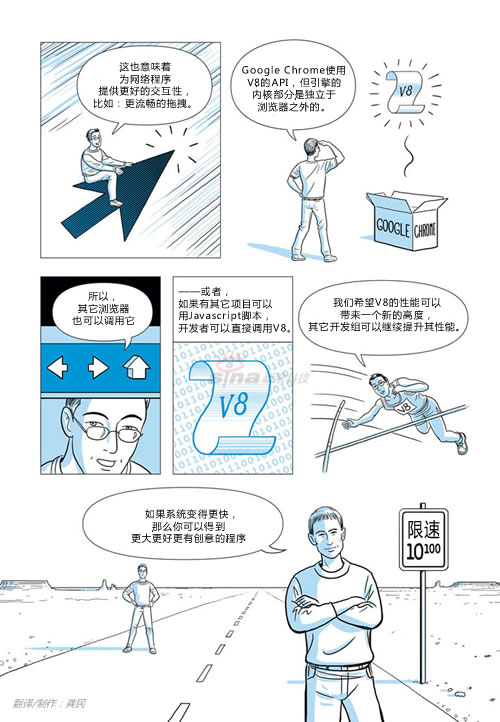
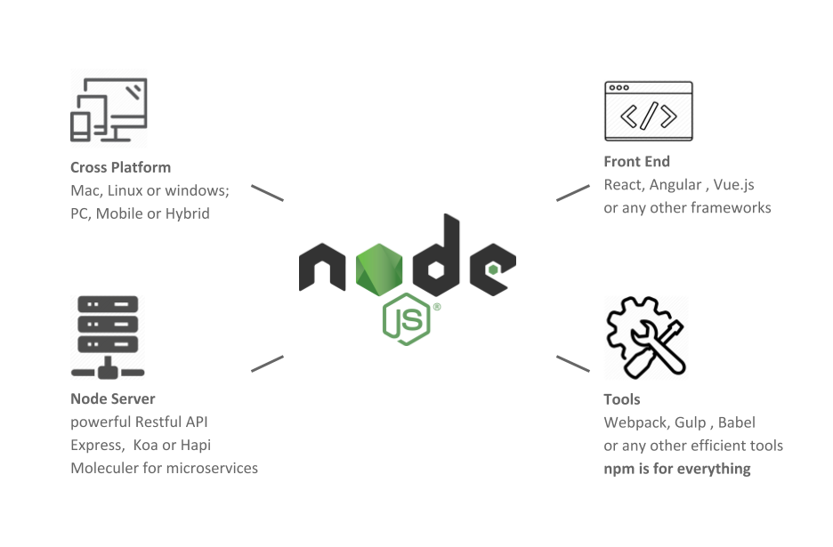
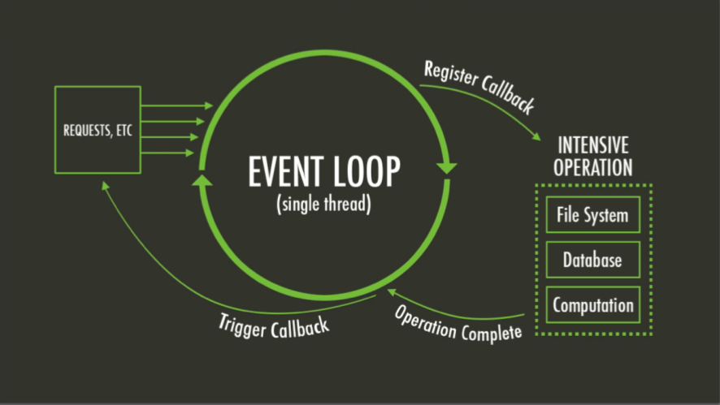
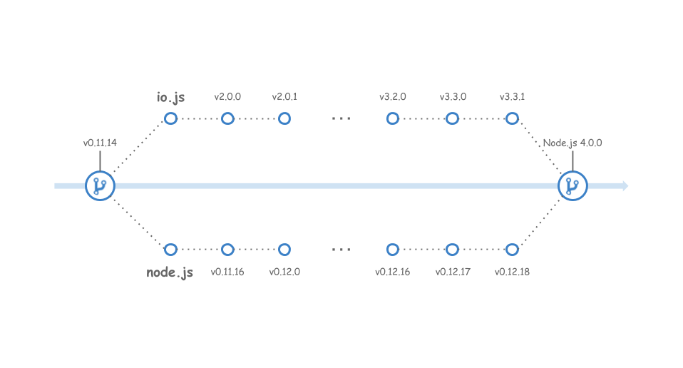

# Node.js 换个角度看世界

[本文配套PPT](./ppt.pdf)

- [Web：一路前行一路忘川](../history/README.md)
- [Node.js：换个角度看世界](../node/README.md)
- [CommonJS：不是前端却革命了前端](../module/README.md)

## 关于 Node.js 

---

### Node.js 是什么

> Node.js® is a JavaScript runtime built on Chrome's V8 JavaScript engine.

按照 [Node.js官网](https://nodejs.org/en/)的解释非常简单：

Node.js® 是一个基于 Chrome V8 引擎 的 JavaScript 运行时。

那我们该怎么理解这句话呢？

- Node.js 不是 JavaScript 的应用、也不是一种框架、更不是一门语言，它是一个 JavaScript 的运行环境，就和浏览器是一个 JavaScript 运行环境一样。

- 它是构建在 Chrome’s V8 这个著名的 JavaScript 引擎之上的。

这里不得不聊聊 Chrome & V8

### Node.js 诞生的背景

2008年，谷歌开发了谷歌地图，但谷歌地图那时是安卓的原生应用，为了进一步扩展谷歌地图的服务范围，谷歌针对浏览器开发了浏览器版本的谷歌地图。而这对浏览器的处理能力提出来更高的要求，于是当时的产品经理 [Sundar Pichai ](https://zh.wikipedia.org/wiki/%E5%AD%99%E8%BE%BE%E5%B0%94%C2%B7%E7%9A%AE%E6%9F%B4)极力说服当时的董事会，要求开发一款浏览器(也就是现在的Chrome)。

> 当时的浏览器市场还是微软的，因为操作系统内置IE，让IE几乎占据整个江山，并且IE是免费的，所以当时要开发一款浏览器遭到了董事会极力反对。因为董事会觉得开发浏览器无利可图。

Sundar Pichai 强调价值不在浏览器本身，而在于它能访问的内容：也就是网络应用程序。当时最卖钱的产品，像 Google 文档、Google 地图 如果想吸引更多的用户使用，并从其中的广告销售牟利，就必须彻底地提高浏览器的性能，最终他说服了董事会，把开发浏览器立了项。

随之而来的就是如何提高浏览器性能的问题？当时项目组认识到，开发者不太愿意使用 JavaScript 是因为它在浏览器中运行得太慢了，和传统语言不是一个量级的。

恰在此时，Lars Bak 出现了。这位 Google Chrome 背后的天才，早在1991年就在硅谷引起了人们的注意，后来成为业界最优秀的程序员之一。可是在2000年初，他选择离开硅谷，回到他的祖国丹麦过幸福的生活，他觉得硅谷的开发者工作太紧张，生活方式不健康。Lars Bak 回到丹麦后，赚了足够的钱养家糊口，就租了一大片农场，开始粉刷农舍。

然后就接到了 Sundar Pichai 的电话。Lars Bak 说 他并不在乎当什么高级经理，他想要做的就是打破技术的边界，于是他接受了 Google 的 offer，但并没有回到硅谷，而是在他自己的农场里就开始了工作。

2008年9月2日，V8 与 Chrome 在同一天宣布开源。世界以非同寻常的方式发现了 Chrome。Chrome 是通过谷歌早前发布的漫画册传出去的 —— 显然是犯了个错误。公关忙成一团来回应这个消息，匆匆忙忙地举行了电话会议，发表博客日志解释到底发生了什么，随后决定开新闻发布会，最后在Googleplex举办产品展示。

> 看过发布会的同学可能会留意到，当时非常仓促，连一个精美的PPT都没有。

漫画中明确提到了将 V8 嵌入到非浏览器项目中的可能性。

### Node.js 的诞生

谈到 Node.js 的诞生，不可避免的要聊到它的创始人 —— Node.js 之父 Ryan Dahl。Ryan Dahl 在开发 Node.js 之前是高性能Web服务的开发专家，在帮客户解决性能问题的同时，碰到了Web服务的**高并发**带来的性能问题，他尝试过很多语言，都失败了。经过多年的研究，Ryan Dahl 大致的感觉到了解决问题的关键是通过**事件驱动和异步I/O**来达成目的。

就在他快要绝望的时候，V8 随着 Chrome 浏览器的问世而出现，JavaScript 脚本语言的执行效率得到质的提升，这给 Ryan Dahl 带来新的启示：JavaScript 本身就是单线程的，而且浏览器发起的 AJAX 请求就是非阻塞的。如果将 JavaScript 和异步 IO 以及一个简单的 HTTP 服务器集合在一起，就会变成一个很酷的东西。他原本的研究就这样与 V8 之间碰撞出火花，V8 满足他关于高性能 Web 服务的所有想象：

1. 没有历史包袱，没有同步 I/O。不会出现一个同步 I/O 导致事件循环性能急剧降低的情况。

2. V8 性能足够好，远远比 Python、Ruby 等其他脚本语言的引擎要快。

3. JavaScript 语言的闭包特性非常方便，比 C 中的回调函数好用。

于是在 2009 年的 2 月，按新的想法他提交了项目的第一行代码，这个项目的名字最终被定名为"node"。

2009 年 5 月，Ryan Dahl 正式向外界宣布他做的这个项目。

2009 年底，Ryan Dahl 在柏林举行的 JSConf EU 会议上发表关于 Node.js 的演讲，之后 Node.js 逐渐流行于世。

总得来说，Node.js 并不是凭空诞生的，它的出现要归功于 Ryan Dahl 历时多年的研究，以及一个恰到好处的节点。

## Node.js 现状

---

2018 年 5 月 31 日，Node.js 基金会发布的[用户调查报告](https://nodejs.org/en/user-survey-report/#overview)，显示学习 Node.js 看起来更容易了，少于 2 年 node 经验的用户中，有 43% 的觉得“容易”。绝大多数（85%）Node.js 用户用于网页开发，43% 参与一些企业级开发，13% 用于大数据分析，8% 用于嵌入式系统。

用户调查报告中还显示，受访的使用者会用如下的词语来描述 Node.js。

更为重要的是，报告显示 Node.js 社区仍然在快速成长。而这得益于 Node.js 的应用场景非常广泛：

越来越多的开发者开始转向 Node.js ，几乎每个公司/小组都会有自己的命令行工具、脚手架。使用 Node.js 能够快速开发各式各样的能极大提高开发效率的神器。

## Node.js 核心科技

---

**Node.js 采用事件驱动、异步编程，为网络服务而设计**

在前面我们聊 Node.js 诞生的时候，就提过 Node.js 之父 Ryan Dahl 在设计 Node.js 时就是为了解决 web 服务高并发带来的性能问题，而这个问题随着 V8 的出现而迎刃而解。

如下图，当网络请求发生时，如果有文件或者数据库操作，Node.js 会注册一个回调函数，然后就去处理下一个请求了。当之前文件或者数据库操作完成后，触发之前注册的事件回调，进而响应之前的网络请求。

由于整个设计都是以事件驱动为核心的，它的重要优势在于，充分利用了系统资源，执行代码无须阻塞等待某种操作完成，有限的资源可以用于其他的任务。

之后的很长一段时间，Ryan Dahl 四处发表演讲，试图说服人们相信阻塞式 IO 是错误的方式，如果使用非阻塞的方式来处理所有的事情，那么就可以解决很多难点。

> 关于事件驱动编程，可以参考我的一篇知乎文章：[《JavaScript运行机制:事件驱动编程详解》](https://zhuanlan.zhihu.com/p/30894022)

**Node.js 的性能不错**

前面提到的用户调查报告中显示，用户评价 Node.js 最多的就是 Fast ，对，就是快！

按照 Ryan Dahl 的说法，性能是 Node.js 考虑的重要因素，选择 C++ 和 V8 而不是别的也是基于性能的考虑。 

Node.js 在设计上比较大胆，它以单进程、单线程模式运行（和 Javascript 的运行方式一致），事件驱动机制是 Node.js 通过内部单线程高效地维护事件循环队列来实现的，没有多线程的资源占用和上下文切换，这意味着面对大规模的 http 请求，Node.js 凭借事件驱动搞定一切。由此我们可以知道这样的设计会导致负载的压力集中在 CPU 而不是内存。所以 Node.js 特别适合 IO 密集型的应用，能够充分发挥 CPU 的威力。

**Node.js 支持 JavaScript**

这是 Node.js 能够发展壮大的一个非常重要的间接原因。

- 首先，Javascript 作为前端工程师的主力语言，在技术社区中有相当的号召力。而且，随着 Web 技术的不断发展，特别是前端的重要性增加，不少前端工程师开始试水”后台应用“，在许多采用 Node.js 的企业中，工程师都表示因为习惯了 Javascript，所以选择 Node.js。

- 其次，Javascript 的匿名函数和闭包特性非常适合事件驱动、异步编程。

- 有 Google V8 引擎的加持，Node.js 的性能也是受益其中。

> 当然事件驱动、异步编程也不是没有它的弊端，当都写成回调函数的形势后，会有违正常人的思维，刚开始会特别不习惯，并且回调太多，容易产生回调地狱，当然后面的 Promise、Async、Await 都致力于解决这个问题。可以参考我的知乎文章[Promise 实现原理精解](https://zhuanlan.zhihu.com/p/58428287)

## Node.js 背后的那些人那些事

---

Node.js 诞生后，就吸引了一群有趣的人参与 Node.js 早期的开发，他们一开始就发现软件包管理在 Node.js 里将会非常有用武之地，于是他们开始各自开发包管理工具。其中有一个痴迷于 Node.js 的 Yahoo 员工 Isaac Schlueter，他辞掉工作，开始专心开发包管理工具(就是现在的 npm )，他曾经深度参与过 Nodejs 的开发，这使得他可以在 Node.js 中实现 CommonJS 的模块规范。

这款包管理工具足够优秀，得到了 Node 官方的大力支持，它赢了。这款包管理工具，或者说 npm，开始和 Node 安装包捆绑打包，它可不是一个单独的第三方插件，不需要你装完 Node 再去下载包管理工具。这块 Node 官方认证的金字招牌一直挂到今天。

也就是在这个时候（2010, Node.js 诞生的第二年），一家位于硅谷的创业公司注意到了该项目。这家公司就是 Joyent，主要从事云计算和数据分析等。Joyent 意识到 Node.js 项目的价值，Joyent 用很少一笔钱从 Ryan Dahl 手中买走了 Node.js 

> 资本家都是喝人血的，Ryan Dahl 就以区区几万美元，把 Node.js 包括源码在内的所有一股脑卖给 Joyent。数百万人每天用 Node.js 作为 JavaScript 开发的工具，而发明 Node.js 的人只用它赚了几万美元。

之后，Ryan Dahl 就加入 Joyent 全职负责 Node.js 的开发，也就是从此刻起，Node.js 进入了它生命历程里的第二个阶段：从个人项目变成一个公司组织下的项目。Joyent 注册了“Node.js”这个商标，使用其相关内容需要得到法律授权。

于此同时，npm 的作者 Isaac Schlueter 被 Joyent 聘来开发 Node.js，但**他保留了 npmjs.org 域名、npm 源码以及源码中的任何专利的所有权**，这些都是他自己的知识产权。这个决定会对后世产生深远影响……

在加入 Joyent 成为全职的 Node 开发人员之后，Ryan Dahl 也随之成为更加重量级的人物。参加各种大会，被粉丝要求合影拍照，随便写点东西都会有很多人响应。但 Ryan 并不喜欢这种状态，他说:"我是一个程序员，我想写代码，我想无拘无束地表达我的想法。我并不喜欢这种状态……"。

2012 年，就在 Node.js 如日中天的时候，Ryan Dahl 选择离开了 Node.js。npm 的作者 Isaac Schlueter 接替他登上了项目组的领导岗位。就是在这个时候，JavaScript 开发者们纷纷登场了，能用 JavaScript 实现某个工具，他们绝对不会看其他语言一眼！因此他们开始用 Javascript 开发 Node 程序，并且乐在其中。

> 真实的原因是什么，我并不知道，但想想都不是这么回事，谁都不傻。

Isaac Schlueter 亲眼目睹过 Joyent 给 Ryan Dahl 出的价格是多么低廉，也知道 Node.js 的价值到底应该值多少钱。于是在 2013 年，他决定让 npm 走商业化路线，因此他向 Joyent 递交了辞呈，成立了一家公司 —— npm 公司。也就是从这个时候开始，Node.js 出现了很严重的问题：贡献频率开始下降，代码提交主要来自社区，代码的版本下降到三个月才能发布一个小版本，社区一直期待的 1.0 版本迟迟不能发布。另外还发生了[人称代词事件](https://www.infoq.cn/article/2013/12/the-power-of-a-pronoun/) 致使 Node.js 项目的活跃度更低，Joyent 对于项目的不作为和其他层面对社区其他成员的干预，导致项目进展十分缓慢，用蜗牛的速度来形容一点也不为过。

2014 年 8 月，以社区里非常有威望的 Mikeal Rogers 为首，几个重要的核心贡献者，发起了 io.js 项目，宣告了 Node.js 社区的正式分裂。io.js 不再是之前的技术负责人模式，取而代之的是技术委员会模式。io.js 于 2015-01-14 发布了 v1.0.0 版本。自此 io.js 一发不可收拾，以周为单位发布新的版本，在架构层面依然保持着 Node.js 的样子（由 Ryan Dahl 时确立）但是对于 ECMAScript 6 持拥抱态度，又重新保持了周为单位的版本更新频率。

于此同时，Joyent 也意识到了问题，成立了临时的 Node.js 顾问委员会，想借助顾问委员会的形式来打造一个更加开放的管理模式，以找到办法来平衡所有成员的需要，为各方提供一个平台来投入资源到 Node.js 项目。顾问委员会调研了 IBM（Eclipse）、Linux 基金会、Apache 等，决定成立 Node.js 基金会的形式。

到了 2015 年 5 月，Node.js 顾问委员会最终决定与 io.js 进行和解，共同制定一个新的管理模式来确保 Node.js 的下一步发展， Joyent 公司本着开放的原则，在这件事情上也做出很大的让步。但此时，io.js 已经发了 2.0 版本，Node.js 远远落后于 io.js ，最终的解决方案是 Node.js 项目和 io.js 项目都将加入 Node.js 基金会，Node.js 基金会之后 Node.js 版本的发布将基于目前 io.js 的进展来进行，也就是说 io.js 会继续保持发布，而 Node.js 的下个大版本跨过 1.0、2.0、3.0，直接到 4.0。如下图所示：

然后，npm 也做大做强了，让 Node.js 的普及率爆炸性增长。所有 JavaScript 开发者都开始用 Node.js 做开发，而 npm 则成为每个 JavaScript 开发者日常工作中不可或缺的一部分。可很少有人知道 npm 是一家企业，是一个由风投资金赞助的私人公司！

npm 的经营策略由一个公司来掌舵，其含义是什么？在去年的这个大会上，Node.js 之父 Ryan Dahl 再次登台演讲。他谈到了 Node.js 的设计误区。其中说了一句话：

> 模块仓库的中心化（甚至由私人所控制）是一种不幸。—— Ryan Dahl

2016年初， npm 圈发生了“一个 11 行的模块引发的血案”。left-pad 工具模块被作者从 npm 上撤下，所有直接或者间接依赖这个模块的 npm 包就忧伤的挂掉了，包括 babel 这样的热门项目。

而其中的原因大概是这样：作者 Azer 写了一个叫 kik 的工具和某个公司同名了，这天公司的律师要求其删掉这个模块，把 kik 这个名字“让”给他们，作者不答应，律师就直接找 npm 了，而 npm 未经作者同意就把包的权限转移给了这家公司。于是，Azer 一怒冲冠，将他所有的 npm 包全部删掉了。

下一节，聊聊 Commonjs 以及 前端模块化规范……

## 参考文献

[如何正确的学习Node.js](https://cnodejs.org/topic/5ab3166be7b166bb7b9eccf7)

[Lars Bak：Google Chrome浏览器背后的天才](http://www.kuqin.com/itman/20090421/47185.html)

[Node.js 与 io.js 那些事儿](https://www.infoq.cn/article/node-js-and-io-js)

[深入浅出 Node.js（一）：什么是 Node.js](https://www.infoq.cn/article/what-is-nodejs)

[NPM的经济风云（上）](https://mp.weixin.qq.com/s/eUpXSk1pEoZCRKZc6bPgSw)

[从 left-pad 事件我们可以学到什么](https://segmentfault.com/a/1190000004700432)